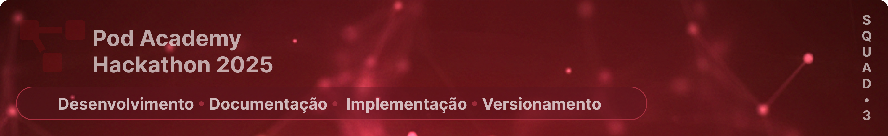

Repositório de desenvolvimento, documentação e implementação técnica de solução integrada de dados para o Hackathon da Pod Academy - Squad 3. 

> Este repositório centraliza a engine de processamento, a implementação da arquitetura medalhão e a aplicação de governança ativa através de contratos de dados e observabilidade nativa.

---

### 🔗 Ecossistema Squad 3
* **Repositório 1 de 2 (Core):** [hackathon-pod-squad3-core](https://github.com/rafa-trindade/hackathon-pod-squad3-core) – _Engine de processamento, arquitetura medalhão e gestão de performance com governança de dados nativa._
* **Repositório 2 de 2 (Ops):** [hackathon-pod-squad3-ops](https://github.com/rafa-trindade/hackathon-pod-squad3-ops) – _Infraestrutura como código (IaC), orquestração de pipelines e estratégias de Cloud Readiness._

> 🔐 O Core define **o que** a arquitetura executa.  
> ⚙️ O Ops define **como e onde** ela é executada.

---

### 📋 Governança Operacional (Gestão de Backlog)

A governança das atividades é realizada por meio de quadros Kanban no **GitHub Projects**, integrando planejamento, execução e versionamento. Esta divisão garante especialização técnica e transparência no progresso das frentes:

* 🧬 **[Data & Analytics - Squad 3](https://github.com/users/rafa-trindade/projects/6):** Ciclo de inteligência analítica, exploração de dados (EDA) e modelos de ML.
* ⚡ **[Data Engineering - Squad 3 (CORE)](https://github.com/users/rafa-trindade/projects/4):** Engine de processamento, arquitetura medalhão e gestão de performance.
* ☁️ **[Data Engineering - Squad 3 (OPS)](https://github.com/users/rafa-trindade/projects/8):** Infraestrutura como código (IaC), orquestração e estratégias de *Cloud Readiness*.

---

## 📚 Mapeamento de Documentação (*Project Hub*)

### 📅 Gestão e Planejamento do Projeto
> 📁 [`docs/project_plan/*`](docs/project_plan/)  
> **Consolida** a visão estratégica e operacional do projeto, integrando o contexto de negócio, objetivos e plano de trabalho da Squad. **Define** o cronograma de entregas, as métricas de sucesso e as responsabilidades de cada frente sob uma abordagem híbrida de governança e agilidade.
>
> * 📑 **Documentos:** [`Entendimento`](docs/project_plan/01-entendimento-problema.md) | [`Abordagem`](docs/project_plan/02-abordagem-tecnica.md) | [`Plano de Trabalho`](docs/project_plan/03-plano-trabalho.md) | [`Cronograma`](docs/project_plan/04-cronograma.md) | [`Riscos`](docs/project_plan/05-riscos-dependencias.md) | [`Métricas`](docs/project_plan/06-metricas-sucesso.md)

---

### 🏗️ Data Architecture
> 📁 [`docs/data_architecture/*`](docs/data_architecture/)  
> **Define** uma stack **Cloud-Ready** orquestrada em ambiente VPS via **Docker** e **Airflow**. **Implementa** MinIO para storage Medallion (S3-API), DuckDB para processamento vetorial e PostgreSQL para o Data Warehouse. **Garante** a entrega de valor via **Modelos (.pkl)** versionados e relatórios analíticos, com suporte a **DataViz (Streamlit)** e estratégia de migração nativa para **OCI**.
>
> * 📑 **Documentos:** [`Arquitetura Técnica (Macro & Micro)`](docs/data_architecture/README.md) | [`Estratégia de Migração (VPS → OCI)`](docs/data_architecture/oci-cloud-ready-strategy.md)

---

### 🏛️ Data Governance
> 📁 [`docs/data_governance/`](docs/data_governance/)  
> **Define** as políticas estruturais para um Data Lake confiável. **Aplica** *Policy as Code* para assegurar a reprocessabilidade total via imutabilidade por execução (`run_id`) e eficiência através de particionamento físico otimizado (`ano_mes`).
>
> * 📑 **Políticas:** [`Retenção`](docs/data_governance/politica-retencao.md) | [`Particionamento`](docs/data_governance/politica-particionamento.md) | [`Qualidade`](docs/data_governance/politica-qualidade.md)

---

### 🧬 Data Lineage
> 📁 [`docs/data_lineage/*`](docs/data_lineage/)  
> Mapeia a jornada completa dos dados sob a arquitetura **Medallion**, garantindo rastreabilidade técnica e governança temporal. A linhagem é validada através de auditorias de integridade e densidade de atributos, culminando na homologação das estratégias de **Expansão (Amplitude)** e **Controle (Densidade)** na camada Gold.
>
> * 📑 **Documentação Principal:** [`Estratégia de Pré-processamento e Baseline (Master Lineage)`](docs/data_lineage/README.md)
> * 📁 **Fluxo de Refino:** [`Refino Técnico (Bronze → Silver)`](docs/data_lineage/bronze_silver/)
> * 📁 **Estratégia Gold:** [`Amplitude e Densidade (Silver → Gold)`](docs/data_lineage/gold/)

---

### 📖 Data Dictionary
> 📁 [`docs/data_dictionary/*`](docs/data_dictionary/)  
> 📖 **Dicionário de Dados (Silver):** Guia de referência das tabelas após os processos de **curadoria, higienização e agregação** de atributos. Consolida a definição das variáveis, garantindo a compreensão clara do grão, das tipagens e da semântica técnica e de negócio de cada entidade.
>
> * 📑 **Dicionários:** [`Atraso`](docs/data_dictionary/atraso-dict.md) | [`Pagamento`](docs/data_dictionary/pagamento-dict.md) | [`Recarga`](docs/data_dictionary/recarga-dict.md) | [`Cadastro`](docs/data_dictionary/dados_cadastrais-dict.md) | [`Telco`](docs/data_dictionary/telco-dict.md) | [`Bureau`](docs/data_dictionary/score_bureau_movel-dict.md)

---

### 🧠 Feature Store & Book de Variáveis
> 📁 [`docs/data_modelling/*`](docs/data_modelling/)  
> **Apresenta** a documentação técnica da Camada Gold. **Consolida** os dicionários de dados organizados por domínios, servindo como o guia oficial para o treinamento e consumo de modelos de Machine Learning.
>
> * 📑 **Books de Variáveis:** [`Target (Labels)`](docs/data_modelling/target/) | [`Features`](docs/data_modelling/features/)

---

### 📊 Analytics & Statistical Modeling
> 📁 [`notebooks/*`](notebooks/)  
> **Integra e Documenta** o ciclo de inteligência analítica desde a exploração até a modelagem. **Diagnostica** o perfil de risco do público-alvo e **materializa** algoritmos de Credit Scoring através de artefatos serializados (**`.pkl`**), provendo suporte técnico e estatístico para as decisões estratégicas de negócio.
>
> * 📑 **Notebooks:** [`Análise Exploratória (EDA)`](notebooks/eda/01_estudo_publico_alvo_cmv.ipynb) | [`Modelagem & Serialização (Modeling)`](notebooks/modeling/)

---

### 🔍 Data Observability
> 📁 [`docs/data_observability/`](docs/data_observability/)  
> **Monitora** a saúde do ecossistema através de métricas de *Freshness*, *Volume*, *Distribution* e *Schema*. **Garante** resiliência operacional através de protocolos de *Health Check* de safras e auditoria de densidade para assegurar a riqueza de informação para Machine Learning.
>
> * 📁 [`Relatórios de Observabilidade`](reports/observability/) - Centraliza as evidências de integridade física (`integrity`), diagnósticos estatísticos (`profiling`) e relatórios de contratos de dados (`quality`).

---

### ✅ Data Quality
> 📁 [`docs/data_quality/*`](docs/data_quality/)  
> **Especifica** os contratos de dados e regras de negócio detalhadas para cada tabela nas camadas Raw e Gold. **Define** critérios de integridade, servindo como a documentação técnica que orienta as validações.
>
> * 📑 [`Política de Qualidade`](docs/data_governance/politica-qualidade.md) - Diretrizes gerais e dimensões de qualidade.
> * 📁 [`Relatórios de Qualidade`](reports/observability/quality/) - Evidências de conformidade de schemas e logs de auditoria das pipelines.

---

### ⚙️ Setup e Reprodução da Solução
> 📁 [`docs/guides/*`](docs/guides/)  
> **Descreve** os protocolos para configuração do ambiente e reprodução integral da solução. **Define** os requisitos de infraestrutura necessários para o processamento vetorizado no DuckDB e **detalha** os passos para acionamento do orquestrador, garantindo a persistência dos logs e a sincronização automática da observabilidade com o Data Lake.
>
> * 📑 **Guia:** [`Guia de Execução da Pipeline`](docs/guides/pipeline_execution.md)