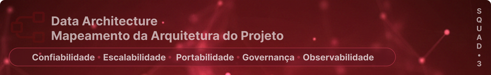
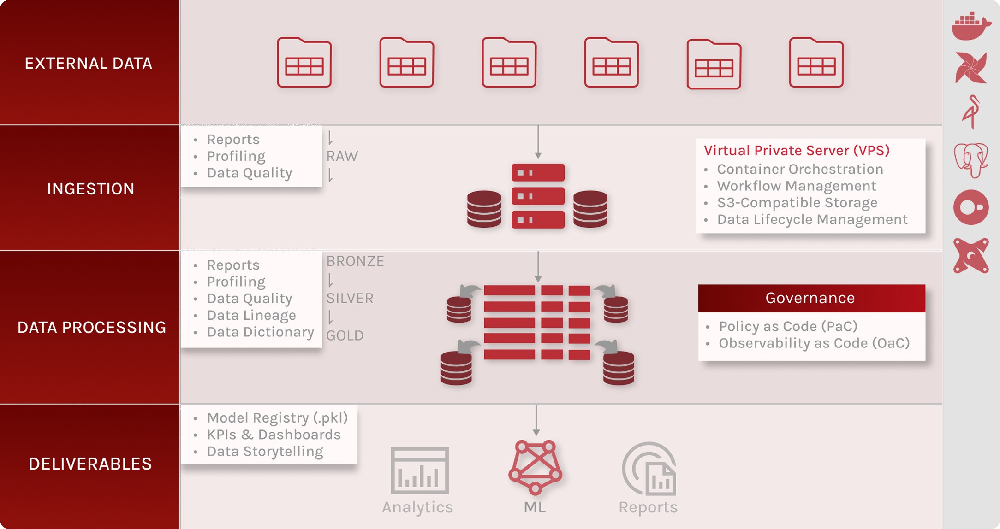
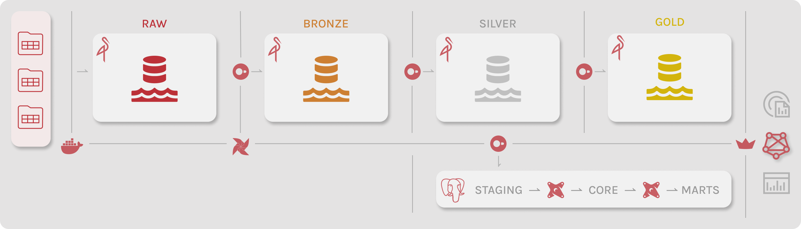

Este documento detalha a arquitetura técnica da plataforma de dados, justificando a escolha das ferramentas para um cenário de execução em **Virtual Private Server (VPS)**. A solução foi desenhada como uma PoC de alta fidelidade, garantindo escalabilidade, portabilidade, governança pragmática e observabilidade nativa.

## 🛠️ Arquitetura Macro (Visão de Fluxo)

A arquitetura macro ilustra o fluxo end-to-end do dado, evidenciando como políticas de governança e mecanismos de observabilidade são aplicados ao longo das etapas de ingestão, processamento e consumo.

### Camadas de Fluxo e Governança Ativa
* **Ingestion & External Data:** Captura de fontes com validação via **Contratos de Dados (Pandera)**, garantindo conformidade antes da persistência na camada Raw/Landing.
* **Data Processing (Medallion):** Implementação das camadas **Bronze, Silver e Gold** no MinIO (S3-Compatible). 
* **Engine de Processamento:** O **DuckDB** executa transformações SQL vetorizadas com alta eficiência em recursos limitados.
* **Data Observability:** Monitoramento automático de *Freshness*, Volumetria e Distribuição Estatística através de auditorias programáticas e logs de integridade.
* **Deliverables:** 
  * **Jupyter Notebook:** Ambiente de experimentação, feature engineering e treinamento de modelos, responsável pela geração do artefato **.pkl** versionado.
  * **Streamlit:** Camada de apresentação para consumo analítico e inferência, utilizando dados certificados da camada **Gold** e o modelo **.pkl**.

## 🛠️ Arquitetura Micro (Visão de Componentes)

A arquitetura micro detalha os componentes da plataforma e seus mecanismos operacionais, evidenciando como isolamento, orquestração e controle de execução sustentam as políticas de governança, confiabilidade e reprodutibilidade.

* **Orquestração (Apache Airflow):** Maestro responsável por garantir a idempotência e a ordem de execução das DAGs.
* **Isolamento (Docker):** Coexistência de serviços (MinIO, Postgres, Airflow) em containers, facilitando o setup e a portabilidade.
* **Data Warehouse (PostgreSQL + dbt):** Modelagem dimensional (Star Schema) para consumo analítico, com governança de transformações via dbt.
* **Camada Analítica & ML:**
  * **Jupyter Notebook:** Executado em ambiente isolado, consome dados da camada Gold para exploração, treino e validação de modelos, gerando artefatos versionados (.pkl).
  * **Streamlit:** Aplicação desacoplada do pipeline, responsável apenas pelo consumo de dados e modelos certificados, sem realizar transformações ou escrita em camadas analíticas.

## 🧱 Matriz de Componentes e Diferenciais Estratégicos

| Componente | Papel na Arquitetura | Diferencial Estratégico (PoC) | Governança Aplicada |
|:---|:---|:---|:---|
| **MinIO** | **Data Lake S3** | **Cloud-Ready:** Migração transparente para ambientes de nuvem via S3-API. | **Imutabilidade:** Estratégia de `run_id` para reprocessabilidade total. |
| **DuckDB** | **Compute Engine** | Performance analítica local sem necessidade de clusters Spark. | **Partition Pruning:** Acelera consultas em até 90% via filtros `ano_mes`. |
| **dbt Core** | **Modelagem Analítica** | Governança de transformações com testes e linhagem automática. | **Documentação Viva:** Reflete o estado real do Warehouse no PostgreSQL. |
| **Pandera** | **Data Quality** | Validação de schema na ingestão (Data Contracts). | **Prevenção de Erros:** Bloqueia inconsistências na entrada do pipeline. |
| **Jupyter Notebook** | **Experimentação & ML** | Treinamento interativo de modelos e feature engineering com baixo overhead operacional. | **Reprodutibilidade:** Notebooks versionados, seeds fixas e datasets imutáveis por `run_id`. |
| **Streamlit** | **Camada de Apresentação** | Exposição rápida de KPIs, métricas e inferências para stakeholders. | **Consumo Governado:** Acesso somente a dados Gold e artefatos de modelo versionados. |

## 🚀 Estratégias de Engenharia e Confiabilidade

Esta PoC implementa pilares de **Data Reliability** que garantem a resiliência operacional na VPS:

1. **Governança via Código (Policy as Code):**
   * **Política de Retenção Ativa:** Limpeza automatizada post-write para evitar esgotamento de storage, mantendo apenas as `MAX_RUNS` necessárias para rollback imediato.
   * **Particionamento Hive:** Padronização da chave `ano_mes=YYYYMM` (BIGINT) auditada programaticamente para evitar *data drift* físico.

2. **Observabilidade Emergente:**
   * **Freshness & Integridade:** Uso da coluna técnica `ingestion_ts` e auditoria de partições para garantir que a estrutura física condiz com a cronologia dos dados.
   * **Saúde de Safra (Health Check):** Monitoramento de volumetria (regra 10%-90%) na Gold Pipeline, impedindo o processamento de cargas incompletas.
   * **Audit de Overlap:** Monitoramento da taxa de encontro de chaves entre camadas para garantir a riqueza de informação necessária à modelagem.

3. **Resiliência e Recuperação:**
   * **Idempotência:** O reprocessamento de um mesmo mês não gera duplicidade; a nova `run_id` substitui logicamente a anterior.
   * **Isolamento de Erros:** Como cada execução é encapsulada por um timestamp ISO, falhas na run atual não corrompem dados históricos estáveis.

   > A arquitetura demonstra que observabilidade e governança não são camadas adicionais, mas propriedades emergentes de decisões corretas de engenharia.
