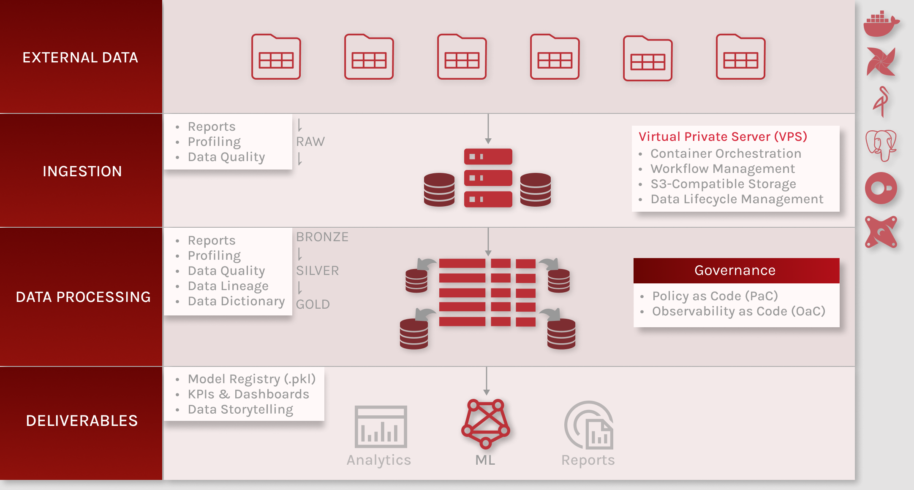
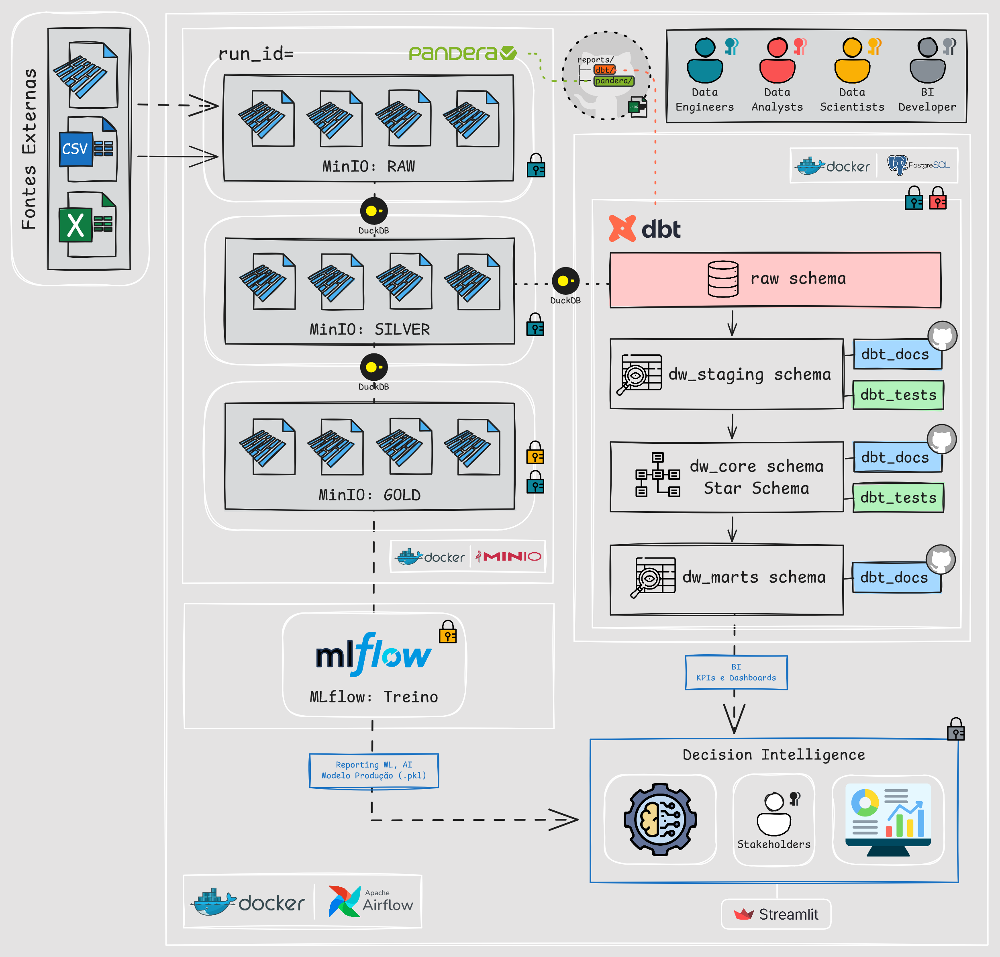

# 🏗️ Data Architecture - Mapeamento de Arquitetura do Projeto

Este documento descreve a **arquitetura técnica do projeto em execução**,
detalhando como os componentes se integram para viabilizar os processos de
ingestão, transformação e armazenamento de dados.

## 🛠️ Arquitetura Macro

## 🛠️ Arquitetura Micro (Rascunho)

## 🧱 Componentes da Arquitetura

| Componente | Papel na Arquitetura | Responsabilidades Técnicas | Diferencial Estratégico |
|-----------|---------------------|----------------------------|-------------------------|
| **MinIO (S3-compatible)** | **Data Lake (Landing / Bronze / Silver / Gold)** | Armazenamento de dados brutos e processados em formato Parquet na camada landing. | Compatibilidade com S3 API, permitindo migração futura para AWS ou outros clouds sem refatoração. |
| **DuckDB** | **Engine de Processamento Analítico** | Leitura de arquivos Parquet no MinIO, execução de transformações SQL vetorizadas e carga dos dados transformados no Data Warehouse PostgreSQL. | Alta performance analítica local para transformação de dados, sem dependência de clusters distribuídos. |
| **dbt (Core + Postgres)** | **Transformações e Modelagem Analítica** | Criação de modelos analíticos no PostgreSQL, testes de integridade, documentação e versionamento lógico do warehouse. | Padronização de transformações e governança leve, alinhada a boas práticas modernas. |
| **Pandera** | **Qualidade e Validação de Dados** | Validação de schema **antes da persistência dos dados na camada Landing do MinIO**, garantindo conformidade na ingestão. | Detecção precoce de inconsistências e garantia de contratos de dados desde a origem. |
| **PostgreSQL** | **Data Warehouse Analítico** | Persistência de dados modelados para consumo por BI e aplicações analíticas. | Banco relacional robusto, amplamente adotado e integrado ao ecossistema dbt/BI. |
| **Docker** | **Infraestrutura e Isolamento** | Containerização de serviços (PostgreSQL, MinIO, aplicações) executados em uma VPS, garantindo reprodutibilidade do ambiente. | Facilidade de setup local, isolamento de serviços e portabilidade para outros ambientes ou cloud. |
| **Streamlit** | **Data App Analítico** | Desenvolvimento de aplicações interativas para exploração e visualização de dados a partir do Data Warehouse PostgreSQL. | Agilidade na criação de interfaces analíticas diretamente conectadas ao DW, sem necessidade de front-end complexo. |

