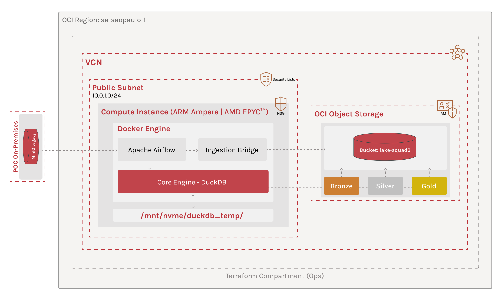

# 🏛️ Data Architecture - Estratégia de Cloud Readiness (OCI Execution)

Este documento detalha a implementação da arquitetura de dados do **Squad 3**, concebida sob o paradigma **Cloud Ready**. A infraestrutura da **Oracle Cloud Infrastructure (OCI)** atua como a plataforma de execução otimizada para o motor de governança e processamento DuckDB.

---

## 🎯 1. Visão Geral da Estratégia: Core & Ops

Para atingir a máxima maturidade arquitetural, separamos a **Inteligência** da **Sustentação**. Essa separação permite que o motor de dados seja agnóstico, enquanto a operação é otimizada para a nuvem através de pilares de **Cloud Readiness**.

*   **🧠 Core (The Engine):** Responsável pela lógica de negócio e transformação. Atua como o **Worker** que executa a arquitetura Medallion e garante a integridade dos dados através de processamento vetorial (DuckDB). É o motor de execução agnóstico à infraestrutura, onde residem os contratos de dados e as regras de qualidade.
*   **🏗️ Ops (The Platform):** Responsável pelo **Provisionamento (IaC)** via Terraform, **Orquestração** via Airflow e **Ingestão Híbrida**. É o que viabiliza a execução do Core com segurança e escalabilidade.

 

> 💡 **Nota de Decisão Arquitetural (Cloud Readiness):** 
> Embora a OCI ofereça serviços gerenciados como *OCI Container Instances* e *OKE (Kubernetes)*, optamos estrategicamente pela execução via **Docker Compose dentro de OCI Compute**. Esta decisão foi tomada para garantir a **Portabilidade Total (Cloud Readiness)**: a solução não possui "lock-in" com serviços proprietários de orquestração da nuvem, permitindo que todo o ecossistema (Airflow + Workers + Ingestão) seja migrado para qualquer provedor Cloud ou ambiente On-premises apenas movendo o arquivo de composição, mantendo a simplicidade operacional sem sacrificar o isolamento de processos.

---

## 🛠️ 2. Fases do Ciclo de Vida Operacional

A execução na OCI foi estruturada em um pipeline de 4 fases totalmente automatizadas:

### **Fase 1: Provisionamento Imutável (Terraform)**
Toda a infraestrutura é erguida via código, garantindo reprodutibilidade:
*   **Networking:** VCN isolada com Subnets públicas e Security Lists configuradas para acesso administrativo (SSH) e operacional (Airflow Webserver).
*   **Identity (IAM):** Implementação de **Dynamic Groups** e **Instance Principals**, permitindo que a VM gerencie objetos no Bucket sem chaves fixas.
*   **Storage:** Bucket `lake-squad3` configurado com API S3-Compatible para integração nativa com DuckDB e Boto3.

### **Fase 2: Bootstrap & Integração (Cloud-Init + Docker)**
No momento do boot da instância, o script `cloud-init.sh` prepara o ambiente:
*   **Stack Docker:** Instalação automatizada do Docker Engine e Docker Compose Plugin para arquitetura ARM64.
*   **Performance Path:** Criação do diretório `/mnt/nvme/duckdb_temp` no host com permissões otimizadas para o motor DuckDB.
*   **Volume Mapping:** O Core é montado como um volume persistente, permitindo atualizações de lógica sem necessidade de redeploy da infraestrutura.

### **Fase 3: Ingestão Híbrida (The Data Bridge)**
A **`dag_ingestion_bridge`** executa o script de migração que conecta o legado à nuvem:
*   **Fluxo:** MinIO (VPS) ➔ OCI Object Storage (Raw).
*   **Tecnologia:** Uso de `upload_fileobj` para transferência via streaming, minimizando o footprint de memória e maximizando o throughput de rede.

### **Fase 4: Orquestração & Injeção de Ambiente**
O Airflow assume o papel de maestro, garantindo a harmonia entre os repositórios:
*   **`dag_core_bootstrap`**: Sincroniza o repositório Core e realiza a **Injeção Dinâmica de Variáveis**. Ela traduz as configurações do Ops para o formato esperado pelo Core, gerando o arquivo `.env` automaticamente.
*   **`dag_core_pipeline`**: Dispara o script unificado `/bin/run_pipeline.sh` do Core, processando as camadas Bronze, Silver e Gold.

---

## 🛡️ 3. Governança e Segurança (Policy as Code)

A arquitetura transporta os pilares de **Cloud Readiness** para a nuvem de forma nativa:

*   **Segurança Zero-Trust:** Uso de *Instance Principals*. A identidade da VM é sua própria credencial de acesso ao Data Lake.
*   **Otimização de Hardware:** Configuração dinâmica de `memory_limit` e `threads` no DuckDB via variáveis de ambiente, aproveitando os 24GB de RAM e 4 OCPUs da instância ARM.
*   **Persistência de Performance:** Mapeamento de volume para o diretório temporário do DuckDB, garantindo que operações de "spill-to-disk" ocorram em alta velocidade e não saturem o container.
*   **Isolamento de Processos:** Separação clara entre logs de orquestração (Airflow) e logs de processamento (Core/DuckDB).

---

## 🛠️ Stack & Estratégia de Hardware

A arquitetura de processamento foi desenhada em duas fases para otimização de performance e custos:

---

### **Fase 1: Sandbox & Testes**
* **Shape:** `VM.Standard.A1.Flex` (ARM Ampere)
* **Recursos:** 4 OCPUs | 24GB RAM
* **Custo:** Always Free Tier (OCI)

---

### **Fase 2: Produção Oficial (Patrocinado) - Atual**
* **Shape:** `VM.Standard.E3.Flex` (AMD EPYC™)
* **Recursos:** 8 OCPUs | 64GB RAM (Escalável)
* **Objetivo:** Alta performance para o motor DuckDB e paralelismo total de DAGs.

---

## 🚀 Status do Provisionamento (Produção Oficial) - 100% Operacional

A infraestrutura do **Squad 3** evoluiu da fase de testes para o ambiente de **Produção Oficial (Patrocinado)**. O provisionamento via Terraform foi concluído com a migração para instâncias de alta performance, garantindo o paralelismo total das DAGs e otimização do motor DuckDB.

---

| Recurso | Status | Descrição |
| :--- | :---: | :--- |
| **Identity (IAM)** | 🟢 | Governança completa com Dynamic Groups e Policies de Produção. |
| **Networking** | 🟢 | VCN e Subnets otimizadas para tráfego de alta carga. |
| **Object Storage** | 🟢 | Bucket `lake` operacional (Camadas Medallion). |
| **Compute Instance**| 🟢 | **Instância AMD EPYC (8 OCPUs / 64GB) ativa e em produção.** |
| **Data Bridge** | 🟢 | Ingestão Raw (MinIO → OCI) em regime de produção. |
| **Orchestration** | 🟢 | Airflow operando com paralelismo total de DAGs. |

---

## 📂 Localização dos Projetos na VM (Cloud Path)

Após o provisionamento e o bootstrap via `cloud-init`, os projetos são organizados para garantir a separação entre orquestração e processamento:

* **📍 Raiz da Aplicação:** `/home/opc/app/`
* **⚙️ Camada Ops (Orquestração):** `/home/opc/app/hackathon-pod-squad3-ops/`
    * _Residência de Dockerfiles, Airflow DAGs e scripts de ingestão._
* **🔐 Camada Core (Processamento):** `/home/opc/app/hackathon-pod-squad3-core/`
    * _Residência do motor DuckDB e regras de governança (Medallion)._
* **⚡ Temp Path:** `/mnt/nvme/duckdb_temp`
    * _Diretório temporário em NVMe dedicado a operações intermediárias do DuckDB (spill, sort, joins pesados)._

---

### 🔗 Ecossistema Squad 3

* **Repositório 1 de 2 (Core):** [hackathon-pod-squad3-core](https://github.com/rafa-trindade/hackathon-pod-squad3-core) - _Engine de processamento, arquitetura medalhão e gestão de performance com governança de dados nativa._
* **Repositório 2 de 2 (Ops):** [hackathon-pod-squad3-ops](https://github.com/rafa-trindade/hackathon-pod-squad3-ops) - _Infraestrutura como código (IaC), orquestração de pipelines e estratégias de Cloud Readiness._

> 🔐 O Core define **o que** a arquitetura executa.  
> ⚙️ O Ops define **como e onde** ela é executada.