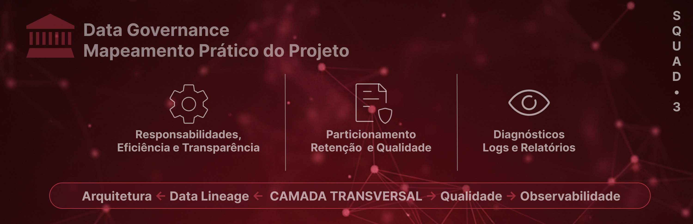

Este diretório concentra as **políticas, diretrizes e decisões estruturais** relacionadas à governança de dados da Squad 3. Nosso foco é garantir que o Data Lake seja uma fonte confiável, escalável e de baixo custo operacional.

A governança neste projeto é **pragmática**, orientada a engenharia e aplicada diretamente via código (*Policy as Code*).

## 📌 Escopo e Princípios

A governança atua de forma transversal para garantir:
- **Reprocessabilidade:** Capacidade de reconstruir qualquer estado anterior.
- **Eficiência:** Uso de formatos (Parquet) e partições (ano_mes) que reduzem custo de Cloud.
- **Transparência:** Documentação viva refletindo exatamente o que está implementado nos scripts.

## 📄 Políticas e Documentos Centrais

### 🧹 Política de Retenção de Dados
📄 [`politica-retencao.md`](politica-retencao.md)
**Foco:** Gestão do ciclo de vida e custos.
- Define a estratégia de **Imutabilidade por Execução** (`run_id`).
- Estabelece o protocolo de limpeza *post-write* para evitar perda de dados em falhas.
- **Implementação:** Reforçada pelo utilitário `scripts/transformations/utils/lake_retention.py`.
- **Persistência de Logs:** Estabelece a sincronização e retenção das evidências de observabilidade no Data Lake, vinculadas ao ciclo de vida das execuções (`run_id`).

---

### 🧭 Política de Particionamento
📄 [`politica-particionamento.md`](politica-particionamento.md)
**Foco:** Performance e padronização de consumo.
- Padroniza a partição única `ano_mes=YYYYMM` (BIGINT) para todos os datasets.
- Habilita o *Partition Pruning* no DuckDB/S3 para acelerar consultas em até 90%.
- **Auditoria:** Auditado pelo script `inspect_partition_*.py`, que garante a conformidade física do particionamento Hive.

---

### ✅ Política de Qualidade de Dados
📄 [`politica-qualidade.md`](politica-qualidade.md)
**Foco:** Contratos de dados e integridade.
- Define as validações estruturais (Bronze/Silver) e auditorias de pipeline (Gold).
- Estabelece regras de **saúde de safra** (volumetria 10%-90%) e **audit de overlap** (âncora de modelagem).
- **Ferramental:** Integração com `Pandera` e validações programáticas customizadas na Gold Pipeline.

## 🏛️ Evidências de Governança (Compliance & Audit)

As evidências de conformidade são geradas automaticamente e armazenadas em dois níveis: **Local** (consulta rápida da última execução) e **Data Lake** (histórico imutável para auditoria).

#### **Acesso Rápido (Última Execução Local)**
- ✅ **Logs de Integridade:** [`reports/observability/integrity/`](../../reports/observability/integrity/) - Cumprimento da Política de Particionamento.
- 📊 **Diagnósticos de Profiling:** [`reports/observability/profiling/`](../../reports/observability/profiling/) - Transparência e saúde estatística dos dados.
- 🛡️ **Relatórios de Qualidade:** [`reports/observability/quality/`](../../reports/observability/quality/) - Aplicação dos Contratos de Dados (Pandera).

#### **Repositório Histórico (Data Lake)**
Todas as evidências acima, incluindo o **Master Pipeline Log** (registro técnico consolidado da execução), são persistidas no S3 de forma versionada para fins de rastreabilidade:
> `s3://lake/observability/reports/run_id={run_id}/`

## ⚙️ Operação e Troubleshooting

Graças às políticas acima, o projeto herda capacidades operacionais críticas:

1. **Rollback Imediato:** Como mantemos as `MAX_RUNS` anteriores, voltar uma versão de um dataset é apenas uma alteração de ponteiro.
2. **Isolamento de Erros:** Uma falha na ingestão da `run_id` atual não corrompe os dados já existentes.
3. **Auditoria Simplificada:** Cada partição e run carregam o metadado de tempo (`ingestion_ts`), com o log técnico de suporte persistido no Lake para rastrear a origem de qualquer inconsistência.
4. **Verificação de Integridade:** O uso da auditoria de partições permite validar se uma carga foi distribuída corretamente, evitando "data drift" físico.

## 🔗 Integração com Outros Domínios

A governança atua como uma camada transversal, garantindo que as definições estratégicas se tornem realidade operacional:

- **Data Architecture:** Define o desenho físico e lógico do lake.
- **Data Lineage:** Permite rastreabilidade ponta a ponta.
- **Data Quality:** Garante confiabilidade semântica.
- **Data Observability:** Monitora saúde, comportamento e garante a persistência das evidências de governança no Data Lake.

Governança, neste contexto, **não é um silo**, mas uma camada transversal.

