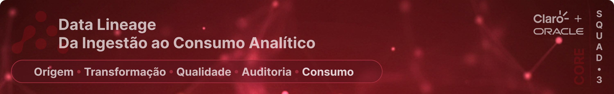
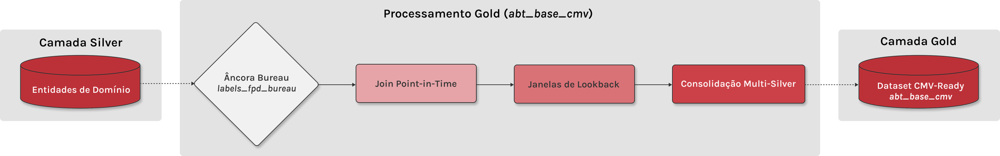
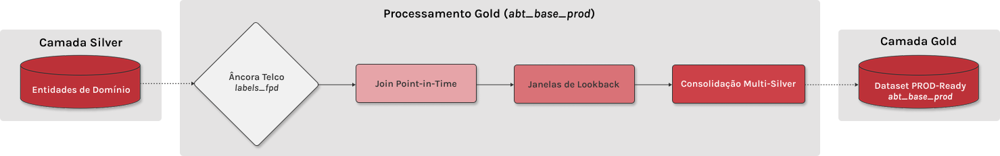

# 📖 1. Pré-processamento e Engenharia de Dados (Data Lineage)

### 🧭 Nota de Escopo - Maturidade da Solução (PoC)

Nesta fase, a solução é apresentada como uma **Prova de Conceito (PoC)** com **execução linear na arquitetura Core**, cujo objetivo é evidenciar o fluxo lógico, a governança aplicada e a reprodutibilidade dos dados dentro de um framework de **Cloud Readiness**.

A **orquestração do pipeline já está definida conceitualmente** e será **migrada para o Apache Airflow na entrega final (Fase 2)**, que consiste na **implementação e deploy na nuvem OCI (Oracle Cloud Infrastructure)**, sem necessidade de alteração nos scripts de processamento que já residem no **Core**. A implementação técnica dessa infraestrutura (Terraform, Docker e Airflow) pode ser acompanhada no repositório dedicado de **Ops**:

- 🚀 **[Repositório de Orquestração & Infraestrutura (Ops)](https://github.com/rafa-trindade/hackathon-pod-squad3-ops)**  
- 📑 **[Estratégia de Migração e Cloud Readiness (VPS → OCI)](../data_architecture/oci-cloud-ready-strategy.md)**

---

## 🏗️ 1.1 Visão Global do Fluxo de Dados (CORE)

Todas as entidades seguem o padrão arquitetural **Medallion (RAW → BRONZE → SILVER → GOLD)**, com responsabilidades bem definidas por camada.  

Esta visão representa o **fluxo lógico comum** do Lakehouse, independentemente de particularidades de implementação ou exceções controladas por tipo de dado.


| Camada | Papel no Pipeline |
|------|------------------|
| **RAW** | Persistência do dado original, sem transformação |
| **BRONZE** | Padronização técnica e organização física |
| **SILVER** | Qualidade, unicidade e enriquecimento |
| **GOLD** | Camada semântica para modelagem (ABTs e Labels ML-ready) |

Entidades contempladas neste fluxo:
- `atraso`
- `pagamento`
- `recarga`
- `dados_cadastrais`
- `score_bureau_movel`
- `telco`
- dimensões de suporte (`atraso_dim` `recarga_dim`)

---

## 🧬 1.2 Princípios Técnicos Aplicados

Para garantir a reprodutibilidade e a confiabilidade, o Lakehouse adota os seguintes princípios em todas as etapas de processamento:

- **Isolamento por Execução (`run_id`):** Todas as transformações são versionadas, permitindo rastreabilidade completa e isolamento de falhas.
- **Particionamento Temporal (`ano_mes`):** Organização física em padrão Hive que habilita o **Partition Pruning**, garantindo que as consultas leiam apenas as pastas necessárias, otimizando drasticamente a performance e o custo de processamento.
- **Grão Analítico Imutável:** Definição rigorosa da unicidade por entidade para evitar duplicação e perda de integridade.
- **Prevenção de Data Leakage:** Governança temporal rigorosa na transição para a camada final via *Point-in-Time Join*.
- **Auditoria Automática:** Validação de integridade e cobertura em cada salto de camada.
- **Persistência de Evidências (Observability):** Centralização de todos os logs técnicos e relatórios de qualidade (`.md` e `.log`) no Data Lake, permitindo que qualquer processamento histórico tenha sua saúde validada retroativamente.

---

## 📥 1.3 Camada RAW - Ingestão

### Objetivo
Garantir a **preservação integral** dos dados recebidos das fontes, sem qualquer modificação estrutural ou semântica.

### Características
- Arquivos no formato original (`parquet` ou `csv`)
- Fonte oficial para reprocessamentos

**Estrutura:**
`s3://lake/raw/{entidade}/*`

---

## 🥉 1.4 Camada BRONZE - Padronização Técnica

Este estágio é **comum a todas as entidades de negócio** e tem como objetivo a **padronização técnica**, mantendo a imutabilidade dos dados.

---

### 🔁 1.4.1 Etapas Comuns de Processamento

**Entidades:** `atraso` `pagamento` `recarga` `dados_cadastrais` `score_bureau_movel` `telco`  

**Origem:** `s3://lake/raw/{entidade}/*.parquet`  
**Destino:** `s3://lake/bronze/{entidade}/run_id={run_id}/ano_mes={YYYYMM}/*.parquet`

| Etapa | Processo | Descrição |
|----:|---------|-----------|
| 1 | **Normalization (Lowercase)** | Conversão de todos os nomes de colunas para minúsculo, eliminando ambiguidades de *case-sensitivity*. |
| 2 | **Tipagem Forte** | Aplicação de `CAST` explícito baseada no profiling da origem. |
| 3 | **Metadados Técnicos** | Inclusão de colunas técnicas (`ingestion_ts` `run_id`) para rastreabilidade e auditoria. |
| 4 | **Particionamento Técnico** | Criação da coluna técnica `ano_mes` derivada da data de referência principal da entidade. |

---

### 🧩 1.4.2 Tratamento Diferenciado - Dimensões Técnicas

As tabelas dimensionais possuem comportamento distinto das tabelas 'Fato', pois representam **cadastros estáveis e de baixo volume**.

**Entidades:** `atraso_dim` `recarga_dim`

**Origem:** `s3://lake/raw/{dimensao}/*.csv`  
**Destinos:** `s3://lake/bronze/{dimensao}/*.parquet`

| Regra | Descrição | Justificativa |
|---|---|---|
| **Estrutura Flat** | Arquivo único, sem particionamento por data ou `run_id`. | Simplifica manutenção e JOINs laterais. |
| **Preservação de Case** | Manutenção do formato original das chaves. | Evita falhas de correspondência. |
| **Snapshot Técnico** | Representam o estado completo do cadastro. | Dimensões não são versionadas por execução. |

---

## 🥈 1.5 Camada SILVER - Qualidade e Enriquecimento

Na camada Silver, os dados são refinados para atender aos **requisitos de qualidade, unicidade e semântica analítica**, respeitando o grão técnico de cada entidade. A estrutura de particionamento físico por `ano_mes` é herdada da camada Bronze, garantindo a consistência organizacional do Lakehouse.

**Origem:** `s3://lake/bronze/{entidade}/**/*.parquet`  
**Destino:** `s3://lake/silver/{entidade}/run_id={run_id}/ano_mes={YYYYMM}/*.parquet`

---

### 🎯 1.5.1 Estratégia de Grão e Unicidade por Entidade

| Entidade | Grão Técnico (Unicidade) |
| :--- | :--- |
| **Atraso** | `num_cpf, contrato, dat_referencia, num_fatura_hash, num_ent_seq_fatura` |
| **Recarga** | `num_cpf, dw_num_ntc, dat_insercao_credito, hor_insercao_credito` |
| **Pagamento** | `num_cpf, contrato, seq_fatura, num_sub_seq_fatura, num_credito_seq` |
| **Dados Cadastrais** | `num_cpf, safra, prod` |
| **Score Bureau** | `num_cpf, safra, prod` |
| **Telco** | `num_cpf, safra, prod` |

---

#### 💡 Notas de Arquitetura e Governança de Dados

> **Exceção Estratégica: Pagamento**  
> Diferente das datas de referência de outras tabelas, a `dat_status_fatura` **não foi incluída** no grão de unicidade.  
> * **Motivo:** Nesta entidade, a data reflete apenas a mudança de estado (Ex: Aberta para Paga) de um registro já existente. Incluí-la causaria a duplicidade do mesmo fato financeiro.
> * **Impacto:** Esta lógica **evitou que 8.163 registros** obsoletos inflassem o somatório de receita, garantindo a "última verdade" de cada lançamento.
>
> **Precisão Temporal e Identificação de Linha: Recarga**
> A combinação da alta granularidade temporal (`hor_insercao_credito`) com o identificador da linha (`dw_num_ntc`) é o que garante a integridade desta entidade.
> * **Detalhe Técnico:** O valor da hora representa os segundos decorridos desde a meia-noite (Padrão SAS/Legacy) e é processado como **BIGINT**, permitindo distinguir transações simultâneas em linhas distintas de um mesmo titular.
> * **Impacto:** Esta estratégia permitiu identificar e remover **4.766.668 registros redundantes**, provenientes de possíveis falhas de *double ingestion* na origem, corrigindo um possível desvio de **4.7%** no faturamento total reportado.

---

### 🔀 1.5.2 Regras de Transformações Específicas

Apesar do fluxo base ser comum, algumas entidades possuem **processamentos adicionais**.

#### A) Enriquecimento via Dimensões *(Aplicável a Atraso e Recarga)*

- JOIN com tabelas dimensionais técnicas
- Inclusão de descrições legíveis ao negócio
- Mapeamento de códigos inexistentes para valores padrão (ex: *"Não Mapeado"*)
- Preservação do grão original da 'Fato' (entidades de domínio com comportamento factual)

---

#### B) Saneamento e Higienização *(Todas as Entidades)*

- Normalização de hashes técnicos associados a valores nulos
- Padronização de identificadores inválidos
- Remoção de colunas sem valor analítico (100% nulas ou obsoletas)
- Reordenação lógica do schema para consumo analítico

---

### 🏁 1.5.3 Resultado da Camada SILVER

Ao final do processamento na camada Silver, todas as entidades apresentam:

- Grão técnico garantido
- Unicidade validada
- Chaves normalizadas
- Schema otimizado
- Dados prontos para análises exploratórias, agregações controladas e estruturação de ativos na camada GOLD

📚 **[Dicionário de Dados - Camada Silver](../data_dictionary/)**

---

## 🥇 1.6 Camada GOLD - Consolidação de Ativos (Expansão & Controle)

A camada **GOLD** materializa os dados para Machine Learning através de ativos semânticos, versionados e auditáveis. Para garantir a **cobertura total do ecossistema** e, simultaneamente, atender às **necessidades de especialização** do projeto, a camada foi estruturada em dois conjuntos de ativos complementares: um focado na **amplitude de público (Expansão)** e outro voltado à **densidade transacional (Controle)**.

---

### 🎯 1.6.1 Objetivos da Camada GOLD

* **Especialização de Target:** Isolar o público CMV para garantir que o sinal de inadimplência reflita estritamente o comportamento móvel, eliminando distorções cruzadas de produtos residenciais (NET/DTH).
* **Visão Baseline:** Manter a paridade com o ecossistema amplo, permitindo auditorias comparativas e benchmarks de performance entre a estratégia focada e a visão geral de negócio.
* **Governança de Contrato:** Servir como **contrato único** de conformidade entre Engenharia e Ciência de Dados, entregando ativos imutáveis, homologados e blindados contra *data leakage*.

---

### 📦 1.6.2 Ativos GOLD Disponíveis

A camada Gold é estruturada em dois conjuntos de ativos para atender simultaneamente à demanda de **Expansão de Mercado** e à de **Estabilidade Transacional**.

#### A) Estratégia de Expansão (Âncora Bureau)
*Ativos especializados para maximizar o volume de treinamento e isolar estritamente o produto móvel.*



| Ativo | Tipo | Finalidade | Fluxo S3 (Origem ➔ Destino) | Evidências e Book |
|:---|:---:|:---|:---|:---|
| **labels_fpd_bureau** | `Target` | Resposta FPD focado no Público-Alvo (CMV). | **Origem:** `silver/score_bureau_movel` <br> **Destino:** `gold/labels_fpd_bureau` | [📊 Profiling](../../reports/observability/profiling/gold/gold-labels_fpd_bureau-profiling.md)  <br>  [📖 Book](../data_modelling/target/labels_fpd_bureau-book.md) |
| **abt_base_cmv** | `ABT` | Ativo de Amplitude de Público e Expansão. | **Origem:** `silver/**/*` + `labels_fpd_bureau` <br> **Destino:** `gold/abt_base_cmv` | [📊 Profiling](../../reports/observability/profiling/gold/gold-abt_base_cmv-profiling.md)  <br>  [📖 Book](../data_modelling/features/abt_base_cmv-book.md) |

---

#### B) Baseline de Controle (Âncora Telco)
*Ativos voltados à densidade de sinais comportamentais e paridade com o ecossistema histórico.*



| Ativo | Tipo | Finalidade | Fluxo S3 (Origem ➔ Destino) | Evidências e Book |
|:---|:---:|:---|:---|:---|
| **labels_fpd** | `Target` | Resposta FPD do Ecossistema (Mix CMV/NET/DTH). | **Origem:** `silver/telco` <br> **Destino:** `gold/labels_fpd` | [📊 Profiling](../../reports/observability/profiling/gold/gold-labels_fpd-profiling.md)  <br>  [📖 Book](../data_modelling/target/labels_fpd-book.md) |
| **abt_base_prod** | `ABT` | Ativo de Densidade Transacional e Controle. | **Origem:** `silver/**/*` + `labels_fpd` <br> **Destino:** `gold/abt_base_prod` | [📊 Profiling](../../reports/observability/profiling/gold/gold-abt_base_prod-profiling.md)  <br>  [📖 Book](../data_modelling/features/abt_base_prod-book.md) |

---

 <br> 

> 🛡️ **Nota de Governança: Diagnóstico Técnico de Cobertura e Atributos**
>
> A coexistência dos dois ativos na camada GOLD é fundamentada nos resultados obtidos via *data profiling* das ABTs, comprovando que as características das tabelas Silver foram preservadas para atender a objetivos distintos:
>
> 1. **Massa de Expansão (`abt_base_cmv` - 2.6M):** Utiliza o target oriundo da `silver/score_bureau_movel`. Garante o volume necessário para treinamento focado no **Público-Alvo**, embora apresente **50.3% de nulos** nas colunas com prefixo `tel_`. É o ativo ideal para garantir a **generalização do modelo** em cenários de prospecção e novos clientes. ([📊 Profiling](../../reports/observability/profiling/gold/gold-abt_base_cmv-profiling.md))
> 2. **Densidade de Controle (`abt_base_prod` - 1.3M):** Utiliza o target oriundo da `silver/telco`. Atua como o **Padrão de Ouro** para calibração, pois retém **99.9% de preenchimento** nas colunas `tel_`. Permite validar se os sinais aprendidos pelo algoritmo são consistentes com o **comportamento transacional interno** (`rec_` `pag_` `atr_`). ([📊 Profiling](../../reports/observability/profiling/gold/gold-abt_base_prod-profiling.md))
> 3. **Isolamento de Risco por Produto:** O profiling na `abt_base_prod` identificou que o produto **DTH apresenta 53.4% de FPD**, enquanto o **CMV estabiliza em 21.2%** na `abt_base_cmv`. A separação dos ativos garante que a predição para o produto móvel (CMV) não seja contaminada pelo risco extremo detectado em produtos residenciais (NET/DTH).
>
> ---
> #### 📊 Direcionamento Estratégico das Âncoras
> A síntese abaixo detalha a **responsabilidade técnica** da arquitetura para garantir tanto a amplitude quanto a fidelidade dos dados:
>
> 

---

### 🛡️ 1.6.3 Governança de Histórico e Versionamento (`run_id`)

A utilização do **run_id** como chave de particionamento na camada Gold transcende a organização técnica, atuando como o pilar de **Imutabilidade dos Experimentos**. Cada execução do pipeline gera um snapshot completo da ABT, preservando o estado exato das features e das Janelas de Lookback naquele instante.

Esta estratégia permite:

* **Comparação A/B de Versões:** Permite confrontar a performance de diferentes versões de modelos (ex: v1 vs v2) sobre a mesma base histórica imutável de CMV.
* **Auditoria de Drift:** Comparação histórica entre diferentes versões da ABT CMV para identificar se a queda de performance de um modelo se deve a mudanças no comportamento dos dados do Bureau.
* **Backtesting e Rollback:** Capacidade de revalidar modelos antigos ou reverter para a base exata de um experimento anterior com total determinismo estatístico.

---

## 🧱 1.7 Estrutura Física de Armazenamento (Padrão Hive)

A organização física segue o padrão Hive para compatibilidade e performance:

```bash
s3://lake/
├── raw/
│   └── {entidade}/
├── bronze/
│   ├── {entidade}/
│   │   └── run_id=YYYYMMDD/
│   │       └── ano_mes=YYYYMM/
│   │           └── data_0.parquet
│   └── {dimensao}/
│       └── dimensao.parquet
├── silver/
│   └── {entidade}/
│       └── run_id=YYYYMMDD/
│           └── ano_mes=YYYYMM/
│               └── data_0.parquet
├── gold/
│   └── {entidade}/
│       └── run_id=YYYYMMDD/
│           └── ano_mes=YYYYMM/
│               └── data_0.parquet 
├── observability/
│   └── reports/
│       └── run_id=YYYYMMDD/
│           ├── pipeline_run_YYYYMMDD.log
│           ├── integrity/ 
│           ├── profiling/
│           └── quality/      
```

---

<br>

# 🧪 2. Estruturação do Modelo Baseline e Governança Temporal

> **Nota Conceitual:** A **ABT** (Analytical Base Table) é a nossa tabela final de consumo físico. Já a **estruturação do baseline** é o conjunto de técnicas e estatísticas aplicadas na construção desta tabela para garantir que o modelo focado no produto **CMV** seja treinado com **total confiabilidade**, sem viés ou *data leakage*.

---

## 📉 2.1 Definição da Analytical Base Table (ABT) e Âncora Temporal
A ABT constitui o ativo final de modelagem, consolidando o passado (features) e o futuro (target) sob rigorosa governança temporal para garantir o alinhamento com o público-alvo CMV.

- **Entidade Principal:** `abt_base_cmv` (Público restrito ao Score de Bureau Móvel).
- **Grão da Tabela (Unicidade):** `num_cpf` + `safra` + `prod`.
- **Âncora de Seleção:** `gold/labels_fpd_bureau` (Target FPD consolidado).
- **Chave de Particionamento:** `ano_mes` (Derivado da Safra para otimização de leitura).
- **Volumetria:** 2.633.900 registros (2.565.985 CPFs únicos).
- **Janela de Observação:** 6 safras (Out/24 a Mar/25).
- **Estabilidade:** Bad Rate médio de 21.23% com desvio máximo entre safras de apenas 1.22 p.p.
- **Odds (Good:Bad):** 3.71:1.

---

## 📊 2.2 Janelas de Lookback e Agregações Históricas
Esta ABT utiliza uma abordagem de **Mesa Farta**. Para cada métrica estatística (Soma, Média, Mínimo, Máximo e Contagem), geramos colunas específicas para quatro horizontes temporais distintos, permitindo ao modelo identificar variações de comportamento (tendência e velocidade).

| Janela | Escopo Técnico | Objetivo |
| :--- | :--- | :--- |
| **L30D** | $T \geq Safra - 30$ | Comportamento imediato e volatilidade de curtíssimo prazo. |
| **L60D** | $T \geq Safra - 60$ | Estabilidade de consumo e detecção de tendências recentes. |
| **L90D** | $T \geq Safra - 90$ | Visão consolidada do último trimestre (Padrão de Crédito). |
| **Geral** | Todo o período ($T < Safra$) | Perfil acumulado e *Lifetime Value* (até 18 meses). |

**Campos de Referência para Filtro Temporal:**
* **Recarga:** `dat_insercao_credito`
* **Pagamento:** `dat_status_fatura`
* **Atraso:** `dat_referencia`

---

## 🧬 2.3 Composição e Nomenclatura dos Ativos

Para garantir que o modelo baseline tenha uma visão 360º do público CMV e interprete corretamente a origem de cada sinal, aplicamos um mapeamento rigoroso de prefixos:

### 2.3.1 Mapeamento de Prefixos (Origens Silver)
| Prefixo | Tabela Origem (Silver) | Estratégia de Captura |
| :--- | :--- | :--- |
| `bur_` | `silver/score_bureau_movel` | Snapshot completo de scores e atributos de Bureau CMV. |
| `cad_` | `silver/dados_cadastrais` | Snapshot completo de atributos demográficos e cadastrais. |
| `tel_` | `silver/telco` | Captura da `flag_instalacao` e variáveis de rede móvel. |
| `rec_` | `silver/recarga` | Agregações estatísticas sobre histórico de créditos. |
| `pag_` | `silver/pagamento` | Agregações estatísticas sobre liquidação de faturas. |
| `atr_` | `silver/atraso` | Agregações estatísticas sobre histórico de inadimplência. |

🔗 **[Book de Variáveis - ABT CMV](../data_modelling/features/abt_base_cmv-book.md)**

### 2.3.2 Padrão de Nomenclatura
O padrão seguido para as features é: `{prefixo}_{métrica}_{janela/tipo}`. 

**Exemplo de interpretação:**
A variável `rec_vlr_avg_l60d` refere-se ao **valor médio de recarga** nos **últimos 60 dias** anteriores à safra de bureau. Esse padrão garante que o modelo baseline receba dados autoexplicativos, facilitando a análise de importância de variáveis (Feature Importance).


---

<br>

# 📉 3. Justificativa do Modelo e Métricas de Performance

> **Nota de Metodologia:** Esta seção detalha as decisões estatísticas para a criação do modelo inicial. A escolha das métricas e do algoritmo baseline segue os padrões da indústria de **Credit Scoring**, visando equilibrar o poder de separação de risco com a necessidade de explicar as decisões de crédito ao negócio.

## 3.1 Escolha do Algoritmo Baseline

O modelo baseline será estruturado via **Regressão Logística com discretização WoE (Weight of Evidence)**.
- **Justificativa:** Esta escolha prioriza a **interpretabilidade** e a **estabilidade** dos coeficientes. O uso de WoE permite capturar relações não-lineares observadas nas curvas de risco e tratar valores nulos de forma robusta, facilitando a validação da monotonicidade conforme exigido em Scorecards de crédito (Siddiqi, 2017).

---

## 3.2 Justificativa da Técnica (Poder Preditivo Univariado)

A técnica baseia-se na identificação de variáveis com alto valor de informação (IV) e Gini. A análise exploratória confirmou o potencial discriminatório da ABT gerada:
- **Principal Preditor:** `bur_score_02` (Gini=43.1% | IV=0.6048 - classificação "Muito Forte").
- **Complementaridade Comportamental:** Variáveis como `pag_vlr_total_geral` (Gini 22%) e `atr_vlr_acumulado_geral` (Gini 15%) provaram ser os melhores complementos ao bureau, adicionando sinais de engajamento financeiro interno.
- **Diferencial de Interação:** A combinação dos scores de bureau em matriz bidimensional amplifica a separação, permitindo identificar nichos de baixíssimo risco (Bad Rate de 6.4%).

---

## 3.3 Métricas de Sucesso e Avaliação Iniciais

Para validar o desempenho inicial do baseline na Banca de Qualificação, definem-se as seguintes metas indicativas:
- **Discriminação:** Gini > 40% (Desenvolvimento) e KS > 30% para garantir separação clara entre bons e maus pagadores.
- **Estabilidade:** PSI (Population Stability Index) < 0.25 entre safras para assegurar que o modelo não sofra com volatilidade temporal.
- **Ordenação:** Verificação de monotonicidade (Bad Rate decrescente conforme o aumento do score).
- **Negócio:** Redução de Bad Rate na aprovação comparado à base "Sem Filtro" e análise de Swap-In/Out.

---

<br>

# 🚀 4. Simulação de Impacto e Política Recomendada (Baseline)

O estudo de público-alvo permitiu simular uma política de crédito simples baseada na combinação de Bureau e Comportamento interno.

### Regra Recomendada (Elegibilidade):
`(bur_score_02 >= 550) AND (idade >= 25 OR bur_score_02 >= 650) AND (pag_vlr_total_geral >= 500)`

### Impacto Estimado na Base:
- **Redução de Risco:** Estimativa de redução de Bad Rate em **~33%** (de 21% para ~14%).
- **Cobertura:** Manutenção de **~65% de aprovação** da base prospectada.
- **Eficiência:** O decil 10 (melhores scores) apresenta um risco **6x menor** que o decil 1, validando o poder de ordenação do baseline.

---

<br>


## 📖 A.1 Glossário Geral da Documentação (Engenharia & Analytics)

Nesta seção, detalhamos os principais conceitos técnicos e terminologias aplicadas no Lakehouse, visando o alinhamento total entre as frentes de Engenharia, Ciência de Dados e Negócio.

### 🏗️ Domínio de Engenharia de Dados
* **Run ID:** Identificador único de uma execução do pipeline, garantindo o isolamento, a rastreabilidade e a reprodutibilidade histórica das cargas.
* **Partition Pruning:** Otimização que permite ler apenas as partições necessárias no S3 (via chaves `ano_mes`), reduzindo drasticamente o tempo e o custo de processamento.
* **ABT (Analytical Base Table):** Tabela final consolidada com variáveis (features) estruturada por safra, pronta para o treinamento de modelos de Machine Learning.
* **Maturidade (D+4):** Tempo de espera técnica necessário para garantir que todos os eventos do mês anterior foram consolidados no Lake antes da geração da camada Gold.
* **Point-in-Time Join:** Técnica de cruzamento de dados que respeita a linha do tempo, garantindo que o modelo use apenas dados disponíveis no momento exato do evento, eliminando o risco de **Data Leakage** (vazamento de dados do futuro).
* **Observability Layer:** Zona de armazenamento dedicada ao histórico de logs, auditorias e profilings, isolada das camadas de negócio para garantir a governança técnica.

---

### 🧪 Domínio de Analytics & Credit Scoring
* **Safra (Observação):** Ponto fixo no tempo (mês/ano) que define o grão da tabela. Para o produto CMV, a base consolidada apresenta **2.633.900 registros**.
* **FPD (First Payment Default):** Variável resposta (Target) que identifica a inadimplência no primeiro pagamento após a migração para o plano controle.
* **Bad Rate:** Taxa de inadimplência, calculada pela razão entre clientes inadimplentes (Bad) e o volume total da base analisada.
* **Gini / AUC:** Métricas de poder discriminatório do modelo (Meta > 40%). Refletem a capacidade do algoritmo de separar bons de maus pagadores.
* **KS (Kolmogorov-Smirnov):** Estatística que mede a distância máxima entre as distribuições acumuladas de clientes adimplentes e inadimplentes (Meta > 30%).
* **IV (Information Value):** Métrica que define o poder preditivo individual de uma variável (Ex: `bur_score_02` possui IV de 0.60, classificado como "Muito Forte").
* **WoE (Weight of Evidence):** Técnica de transformação de variáveis para discretizar faixas de risco e garantir a monotonicidade do modelo.
* **PSI (Population Stability Index):** Métrica de monitoramento de estabilidade da distribuição dos dados entre diferentes safras ou períodos (Meta < 0.25).
* **OOT (Out-of-Time):** Validação do modelo em um período futuro (Ex: Fev/25 e Mar/25), não utilizado no treino, para testar a robustez em dados reais.
* **Mesa Farta:** Abordagem de *Feature Engineering* consistente em gerar o máximo de variáveis estatísticas em janelas de **Lookback** (30, 60, 90 dias) para identificar as melhores correlações.

<br>

## 📚 A.2 Apêndices e Documentação de Suporte

Nesta seção encontram-se os manuais detalhados que compõem a governança técnica e os ativos gerados pelo pipeline.

### 🏗️ Arquitetura e Infraestrutura
- 🏗️ **[Manual de Arquitetura de Dados](../data_architecture/README.md):** Visão macro/micro e stack tecnológica.
- 🚀 **[Estratégia de Deploy OCI (Cloud Readiness)](../data_architecture/oci-cloud-ready-strategy.md):** Plano de migração VPS -> Nuvem.

---

### 🏛️ Governança e Operação
- 🏛️ **[Manual de Governança de Dados](../data_governance/README.md):** Políticas de privacidade, acesso e qualidade.
- 🧬 **[Manual de Lineage](../data_lineage/README.md):** Mapeamento detalhado do fluxo de transformação.
- 🔍 **[Manual de Observabilidade](../data_observability/README.md):** Guia de logs e saúde do pipeline.

---

### 📓 Notebooks e Inteligência Analítica
- 📓 **[Análise Exploratória (EDA)](../../notebooks/eda/01_estudo_publico_alvo_cmv.ipynb):** Estudo aprofundado do público-alvo, diagnóstico de risco e validação de hipóteses.
- 🧪 **[Modelagem Estatística (Modeling)](../../notebooks/modeling/):** Experimentos de algoritmos e script de treinamento para geração dos artefatos serializados (.pkl).

---

### 🗂️ Catálogo de Dados
- 📖 **[Dicionário de Variáveis (Book) - ABT CMV](../data_modelling/features/abt_base_cmv-book.md):** Definição técnica de cada feature gerada na Gold.
- 📖 **[Dicionário de Dados - Camada Silver](../data_dictionary/):** Descrição das entidades saneadas e prontas para consumo.

---

<br>

## 🧭 A.3 Roadmap Detalhado - Próximos Passos (Framework CRISP-DM)

Esta seção detalha o plano de trabalho para a Fase 2, estabelecendo a sequência lógica e as dependências técnicas entre a Engenharia e a Ciência de Dados até a entrega final.

| Fase CRISP-DM | Atividade | Entregável | Dependência |
| :--- | :--- | :--- | :--- |
| **Data Understanding** | Estudo de Público-Alvo | Notebook de EDA | - |
| **Data Preparation** | Discretização WoE das variáveis selecionadas | Dataset transformado | EDA / Estudo de Público |
| **Data Preparation** | Tratamento de missings (categoria especial) | Dataset limpo | EDA / Estudo de Público |
| **Data Preparation** | Split temporal (train/test/OOT) | Conjuntos definidos | Estabilidade de safras verificada |
| **Modeling** | Modelo baseline (Regressão Logística) | Modelo v1.0 | Data Preparation |
| **Modeling** | Feature selection (Stepwise, LASSO, Boruta) | Variáveis finais | Modelo baseline |
| **Modeling** | Modelos avançados (XGBoost, LightGBM) | Comparativo de performance | Feature selection |
| **Evaluation** | Métricas de performance (Gini, KS, AUC) | Report de métricas | Modelo final |
| **Evaluation** | Validação out-of-time (OOT) | Estabilidade confirmada | Modelo final |
| **Evaluation** | Análise de Swap-In/Out | Ganho incremental de receita | Política de crédito definida |
| **Deployment** | Documentação técnica completa | Documento final da solução | Avaliação concluída |
| **Deployment** | Scorecard interpretável | Tabela de pontos para negócio | Modelo aprovado |

---

### 🎯 Objetivos Estratégicos (Fase 2)
* **Refinamento do Scorecard:** Evoluir da PoC para um modelo produtivo com discretização WoE, garantindo a interpretabilidade exigida pelo negócio.
* **Benchmark Challenger:** Testar algoritmos de Gradient Boosting para desafiar a performance do baseline e maximizar o Gini.
* **Deploy Cloud Native:** Migrar a execução Core para o ecossistema orquestrado (Airflow/OCI) conforme detalhado no repositório de Ops.
