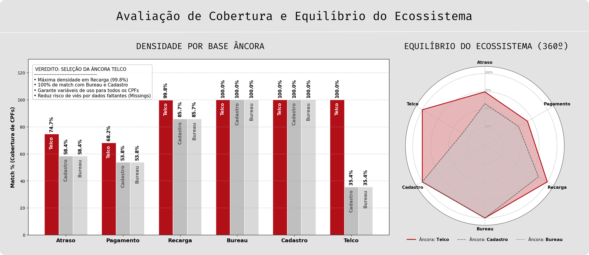
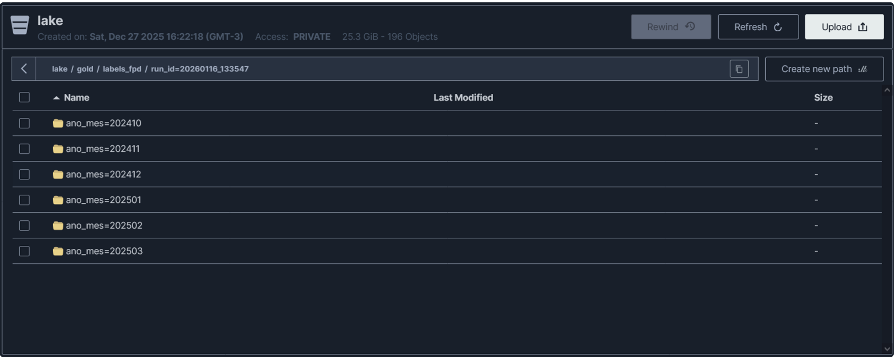

## 📉 Visão Geral - `labels_fpd` (Gold Layer)

- **Entidade Principal:** Target de Modelagem (FPD - First Payment Default)
- **Grão da Tabela (Unicidade):** `num_cpf, safra, prod`
- **Âncora de Seleção:** `telco` (Ecossistema de Intenção e Comportamento)
- **Chave de Particionamento:** `ano_mes` (Derivado da `safra`)

---

## 🎯 Estratégia de Seleção de Target (Âncora)

A definição da base âncora para a camada Gold foi precedida por um estudo exaustivo de cobertura. O objetivo foi equilibrar o volume absoluto com a densidade de informações disponíveis para as fases de *Feature Engineering*.

### 1. Estudo de Cobertura de Ecossistema

#### 🔍 Análise Base Âncora: `telco`
- **Total de CPFs únicos:** `1.272.095`

| Comparado com         | Match %   | CPFs Encontrados   |
|:---------------------|:----------|:-------------------|
| `atraso`             | 74.74%    | 950.731            |
| `pagamento`          | 68.16%    | 867.035            |
| `recarga`            | 99.78%    | 1.269.268          |
| `score_bureau_movel` | 100.00%   | 1.272.095          |
| `dados_cadastrais`   | 100.00%   | 1.272.095          |

---

#### 🔍 Análise Base Âncora: `dados_cadastrais` / `score_bureau`
- **Total de CPFs únicos:** `3.590.459`

| Comparado com         | Match %   | CPFs Encontrados   |
|:---------------------|:----------|:-------------------|
| `atraso`             | 58.38%    | 2.095.944          |
| `pagamento`          | 53.77%    | 1.930.502          |
| `recarga`            | 85.72%    | 3.077.601          |
| `telco`              | 35.43%    | 1.272.095          |

---

### 🏆 Veredito Técnico: Seleção da Base `TELCO`

A escolha do melhor Target depende do que a Squad prioriza: Volume Total (Alcance) ou Riqueza de Features (Poder Preditivo). Para este projeto, o veredito é a utilização da base **TELCO**.

**Justificativa:**
1. **Match de Ecossistema (Riqueza):** Possui um overlap de **99.78% com Recarga**. Quase 100% dos clientes possuem comportamento transacional ativo, o que é fundamental para o ganho marginal de KS buscado.
2. **Qualidade Cadastral:** Possui **100% de match** com Cadastral e Bureau, eliminando "buracos" de informação básica.
3. **Equilíbrio Financeiro:** Com 68% de match em pagamento, oferece a base perfeita para modelar o "Pós-pago" e o "Pré-pago de alto valor" (Proxy de Confiança).

**📊 Comparativo de Decisão:**

| Critério | Âncora: `TELCO` | Âncora: `BUREAU / CADASTRO` |
| :--- | :--- | :--- |
| **Volume (n)** | 1.272.095 (Foco) | 3.590.459 (Massa) |
| **Densidade de Features** | **Alta** (Foco em sinal de rede/uso) | **Baixa** (65% sem dados Telco) |
| **Risco de "Missings"** | Mínimo | Alto (Base "fantasma" para features) |

---



---

## ✅ Data Lineage - `labels_fpd`

### 1. Visão Geral

| Item            | Valor                                 |
|-----------------|---------------------------------------|
| Origem          | `silver/telco`                        |
| Versionamento   | `run_id` (Isolamento de Execução)     |
| Particionamento | `ano_mes` (Coluna Técnica)            |




### 2. Fluxo de Transformação: SILVER → GOLD

**Origem:** `s3://lake/silver/telco/**/*.parquet`  
**Destino:** `s3://lake/gold/labels_fpd/run_id={run_id}/ano_mes={YYYYMM}/*.parquet`

| Etapa | Processo | Descrição | Ações / Regras |
|------:|:---------|:----------|:---------------|
| 1 | **Filtragem de Target** | Saneamento de Labels | Remoção de registros onde a label `fpd` é nula para garantir a integridade do treino. |
| 2 | **Deduplicação de Grão** | Unicidade Final | Aplicação de `QUALIFY ROW_NUMBER` particionado por `num_cpf, safra, prod` ordenado pelo `ingestion_ts` mais recente. |
| 3 | **Cálculo de Partição** | Organização Temporal | Derivação da coluna técnica `ano_mes` a partir da coluna `safra`. |
| 4 | **Auditoria de Overlap** | Health Check de Ecossistema | Cruzamento em tempo real com as tabelas de `atraso`, `pagamento`, `recarga`, `cadastral` e `bureau` para emissão do Quality Report. |

---

### 3. Protocolo de Observabilidade e Qualidade (Data Quality)

O pipeline de geração da camada Gold executa uma bateria automática de testes antes da persistência final. Os resultados são centralizados no log de qualidade, que serve como evidência de conformidade para a Squad e Stakeholders.

#### 📄 Evidência de Execução (Quality Report)
O log abaixo reflete a última execução bem-sucedida, validando a integridade das safras e a riqueza do ecossistema para modelagem.

**Métricas Monitoradas:**
- **Unicidade no Grão:** Garantia de zero duplicatas no conjunto `CPF + Safra + Produto`.
- **Missing Target:** Validação de 0% de nulos na coluna `fpd`.
- **Saúde de Safra:** Verificação da representatividade percentual de cada mês (Status `WARN` se safra < 10% ou > 90% do volume total).
- **Overlap Audit:** Percentual de match com as tabelas Silver de Features.

```text
📋 QUALITY REPORT - labels_fpd | RUN: 20260116_133547
----------------------------------------------------------------------------------
TESTE                         | STATUS     | OBSERVAÇÃO
----------------------------------------------------------------------------------
Unicidade no Grão             | PASS       | 0 duplicatas
Missing FPD Gold = 0          | PASS       | 0 nulos
----------------------------------------------------------------------------------
Distribuição Safra 202410     | PASS       | 15.7%
Distribuição Safra 202411     | PASS       | 17.5%
Distribuição Safra 202412     | PASS       | 17.6%
Distribuição Safra 202501     | PASS       | 17.1%
Distribuição Safra 202502     | PASS       | 15.8%
Distribuição Safra 202503     | PASS       | 16.1%
----------------------------------------------------------------------------------
Overlap dados_cadastrais      | PASS       | 100.00% de match
Overlap score_bureau_movel    | PASS       | 100.00% de match
Overlap atraso                | PASS       | 74.74% de match
Overlap pagamento             | WARN       | 68.16% de match
Overlap recarga               | PASS       | 99.78% de match
----------------------------------------------------------------------------------
Saneamento (Missing)          | INFO       | Descartados 45,936 registros (3.36%)
----------------------------------------------------------------------------------
```
> 🔗 **Acesse o log de auditoria:** [gold-labels_fpd-quality.log](../../../reports/observability/quality/pipeline/gold-labels_fpd-quality.log)

> 🔗 **Acesse o Profiling Detalhado:** [gold-labels_fpd-profiling.md](../../../reports/observability/profiling/gold/gold-labels_fpd-profiling.md)

---

### 4. Observações Técnicas

- **Idempotência:** O uso de `OVERWRITE_OR_IGNORE` combinado com o particionamento por `ano_mes` garante que reprocessamentos de uma safra específica sejam limpos e consistentes.
- **Isolamento via Run_ID:** Cada execução gera um novo diretório físico, permitindo auditoria histórica e *rollbacks* rápidos através da Política de Retenção.
- **ML Ready:** A base resultante é filtrada e auditada especificamente para alimentar os modelos de Machine Learning, com garantia de densidade de variáveis Telco e Bureau.

---

### 💡 Notas de Auditoria Técnica

1. **Justificativa do Overlap de Pagamento:** O status `WARN` (68.16%) no overlap de pagamento é um comportamento **esperado e validado** pela Squad. Ele reflete a parcela da base composta por clientes "Pré-pago Puro", que não possuem faturas na Silver de Pagamentos, mas são qualificados via Silver de Recarga (99.78% de match).
2. **Estabilidade Temporal:** A Distribuição de Safra apresenta um desvio padrão mínimo, garantindo que o modelo não será treinado com vieses de sazonalidade ou falhas de carga em meses específicos.
3. **Veredito Final:** Com 100% de cobertura em Cadastro e Bureau, e alta densidade em variáveis de comportamento Telco, o dataset está oficialmente homologado para a fase de treinamento.