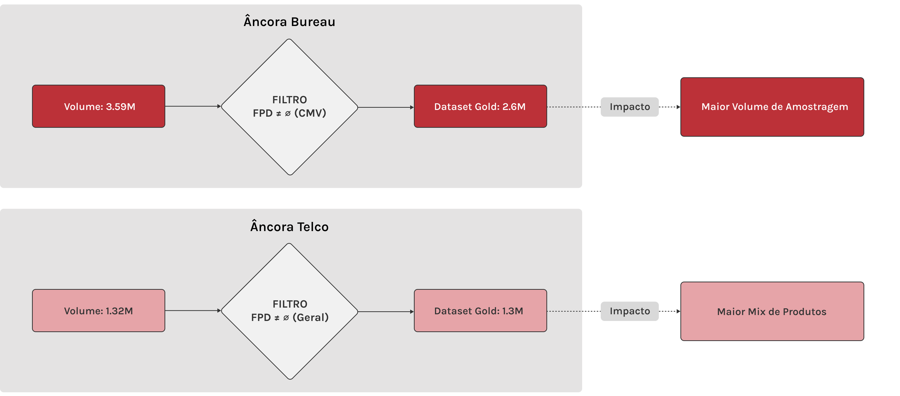
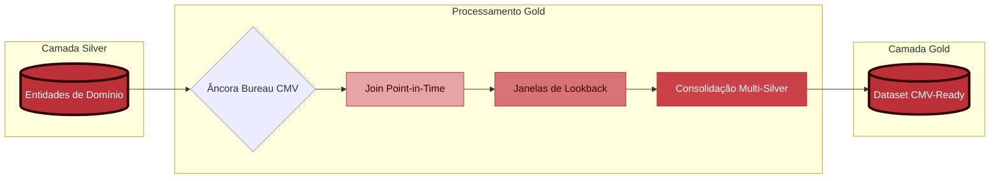

# 📖 Documentação de Data Lineage & Processamento de Dados

### 🧭 Nota de Escopo - Maturidade da Solução (PoC)

Nesta fase, a solução é apresentada como uma **Prova de Conceito (PoC)** com **execução linear na arquitetura Core**, cujo objetivo é evidenciar o fluxo lógico, a governança aplicada e a reprodutibilidade dos dados dentro de um framework de **Cloud Readiness**.

A **orquestração do pipeline já está definida conceitualmente** e será **migrada para o Apache Airflow na entrega final (Fase 2)**, que consiste na **implementação e deploy na nuvem OCI (Oracle Cloud Infrastructure)**, sem necessidade de alteração nos scripts de processamento que já residem no **Core**. A implementação técnica dessa infraestrutura (Terraform, Docker e Airflow) pode ser acompanhada no repositório dedicado de **Ops**:

- 🚀 **[Repositório de Orquestração & Infraestrutura (Ops)](https://github.com/rafa-trindade/hackathon-pod-squad3-ops)**  
- 📑 **[Estratégia de Migração e Cloud Readiness (VPS → OCI)](../data_architecture/oci-cloud-ready-strategy.md)**

---

## 🏗️ 1. Visão Global do Fluxo de Dados (CORE)

Todas as entidades seguem o padrão arquitetural **Medallion (RAW → BRONZE → SILVER → GOLD)**, com responsabilidades bem definidas por camada.  

Esta visão representa o **fluxo lógico comum** do Lakehouse, independentemente de particularidades de implementação ou exceções controladas por tipo de dado.


| Camada | Papel no Pipeline |
|------|------------------|
| **RAW** | Persistência do dado original, sem transformação |
| **BRONZE** | Padronização técnica e organização física |
| **SILVER** | Qualidade, unicidade e enriquecimento |
| **GOLD** | Camada semântica para modelagem (ABTs e Labels ML-ready) |

Entidades contempladas neste fluxo:
- `atraso`
- `pagamento`
- `recarga`
- `dados_cadastrais`
- `score_bureau_movel`
- `telco`
- dimensões de suporte (`atraso_dim`, `recarga_dim`)

---

## 🧬 2. Princípios Técnicos Aplicados

Para garantir a reprodutibilidade e a confiabilidade, o Lakehouse adota os seguintes princípios em todas as etapas de processamento:

- **Isolamento por Execução (`run_id`):** Todas as transformações são versionadas, permitindo rastreabilidade completa e isolamento de falhas.
- **Particionamento Temporal (`ano_mes`):** Organização física em padrão Hive que habilita o **Partition Pruning**, garantindo que as consultas leiam apenas as pastas necessárias, otimizando drasticamente a performance e o custo de processamento.
- **Grão Analítico Imutável:** Definição rigorosa da unicidade por entidade para evitar duplicação e perda de integridade.
- **Prevenção de Data Leakage:** Governança temporal rigorosa na transição para a camada final via *Point-in-Time Join*.
- **Auditoria Automática:** Validação de integridade e cobertura em cada salto de camada.
- **Persistência de Evidências (Observability):** Centralização de todos os logs técnicos e relatórios de qualidade (`.md` e `.log`) no Data Lake, permitindo que qualquer processamento histórico tenha sua saúde validada retroativamente.

---

## 📥 3. Camada RAW - Ingestão

### Objetivo
Garantir a **preservação integral** dos dados recebidos das fontes, sem qualquer modificação estrutural ou semântica.

### Características
- Arquivos no formato original (`parquet` ou `csv`)
- Fonte oficial para reprocessamentos

**Estrutura:**
`s3://lake/raw/{entidade}/*`

---

## 🥉 4. Camada BRONZE - Padronização Técnica

Este estágio é **comum a todas as entidades de negócio** e tem como objetivo a **padronização técnica**, mantendo a imutabilidade dos dados.

---

### 4.1 🔁 Etapas Comuns de Processamento

**Entidades:** `atraso`, `pagamento`, `recarga`, `dados_cadastrais`, `score_bureau_movel`, `telco`  

**Origem:** `s3://lake/raw/{entidade}/*.parquet`  
**Destino:** `s3://lake/bronze/{entidade}/run_id={run_id}/ano_mes={YYYYMM}/*.parquet`

| Etapa | Processo | Descrição |
|----:|---------|-----------|
| 1 | **Normalization (Lowercase)** | Conversão de todos os nomes de colunas para minúsculo, eliminando ambiguidades de *case-sensitivity*. |
| 2 | **Tipagem Forte** | Aplicação de `CAST` explícito baseada no profiling da origem. |
| 3 | **Metadados Técnicos** | Inclusão de colunas técnicas (`ingestion_ts`, `run_id`) para rastreabilidade e auditoria. |
| 4 | **Particionamento Técnico** | Criação da coluna técnica `ano_mes = YYYYMM`, derivada da data de referência principal da entidade. |

---

### 4.2 🧩 Tratamento Diferenciado - Dimensões Técnicas

As tabelas dimensionais possuem comportamento distinto das tabelas 'Fato', pois representam **cadastros estáveis e de baixo volume**.

**Entidades:** `atraso_dim` `recarga_dim`

**Origens:** `s3://lake/raw/{dimensao}/*.csv`  
**Destinos:** `s3://lake/bronze/{dimensao}/*.parquet`

| Regra | Descrição | Justificativa |
|---|---|---|
| **Estrutura Flat** | Arquivo único, sem particionamento por data ou `run_id`. | Simplifica manutenção e JOINs laterais. |
| **Preservação de Case** | Manutenção do formato original das chaves. | Evita falhas de correspondência. |
| **Snapshot Técnico** | Representam o estado completo do cadastro. | Dimensões não são versionadas por execução. |

---

## 🥈 5. Camada SILVER - Qualidade e Enriquecimento

Na camada Silver, os dados são refinados para atender aos **requisitos de qualidade, unicidade e semântica analítica**, respeitando o grão técnico de cada entidade. A estrutura de particionamento físico por `ano_mes` é herdada da camada Bronze, garantindo a consistência organizacional do Lakehouse.

**Origem:** `s3://lake/bronze/{entidade}/**/*.parquet`  
**Destino:** `s3://lake/silver/{entidade}/run_id={run_id}/ano_mes={YYYYMM}/*.parquet`

---

### 5.1 🎯 Estratégia de Grão e Unicidade por Entidade

| Entidade | Grão Técnico (Unicidade) |
|---|---|
| **Atraso** | `num_cpf, contrato, dat_referencia, num_fatura_hash, num_ent_seq_fatura` |
| **Recarga** | `num_cpf, dat_insercao_credito, hor_insercao_credito` |
| **Pagamento** | `num_cpf, contrato, seq_fatura, num_sub_seq_fatura` |
| **Dados Cadastrais** | `num_cpf, safra, prod` |
| **Score Bureau** | `num_cpf, safra, prod` |
| **Telco** | `num_cpf, safra, prod` |

---

### 5.2 🔀 Regras de Transformação Específicas

Apesar do fluxo base ser comum, algumas entidades possuem **processamentos adicionais**.

#### A) Enriquecimento via Dimensões *(Aplicável a Atraso e Recarga)*

- JOIN com tabelas dimensionais técnicas
- Inclusão de descrições legíveis ao negócio
- Mapeamento de códigos inexistentes para valores padrão (ex: *"Não Mapeado"*)
- Preservação do grão original da 'Fato' (entidades de domínio com comportamento factual)

---

#### B) Saneamento e Higienização *(Todas as Entidades)*

- Normalização de hashes técnicos associados a valores nulos
- Padronização de identificadores inválidos
- Remoção de colunas sem valor analítico (100% nulas ou obsoletas)
- Reordenação lógica do schema para consumo analítico

---

### 5.3 🏁 Resultado da Camada SILVER

Ao final do processamento na camada Silver, todas as entidades apresentam:

- Grão técnico garantido
- Unicidade validada
- Chaves normalizadas
- Schema otimizado
- Dados prontos para análises exploratórias, agregações controladas e estruturação de ativos na camada GOLD

---

## 🥇 6. Camada GOLD - Consumo Analítico e Modelagem (Estratégia CMV)

A camada **GOLD** materializa os dados para Machine Learning através de ativos semânticos, versionados e auditáveis. Para garantir a **cobertura total do ecossistema** e, simultaneamente, atender às **necessidades de especialização** do projeto, a camada foi estruturada em dois conjuntos de ativos com finalidades distintas: um focado na **especificidade do produto CMV** e outro voltado ao baseline geral.

---

### 6.1 🎯 Objetivos da Camada GOLD

* **Especialização de Target:** Isolar o público CMV para garantir que o sinal de inadimplência reflita estritamente o comportamento móvel, eliminando distorções cruzadas de produtos residenciais (NET/DTH).
* **Visão Baseline:** Manter a paridade com o ecossistema amplo, permitindo auditorias comparativas e benchmarks de performance entre a estratégia focada e a visão geral de negócio.
* **Governança de Contrato:** Servir como **contrato único** de conformidade entre Engenharia e Ciência de Dados, entregando ativos imutáveis, homologados e blindados contra *data leakage*.

---

### 6.2 📦 Ativos GOLD Disponíveis

Para garantir a cobertura total do ecossistema e atender às necessidades específicas de modelagem, a camada Gold disponibiliza dois conjuntos de ativos com finalidades distintas:

#### A) Ativos Focados em CMV (Estratégia Atual)
*Foco em Especialização de Produto e Volume Histórico.*

| Ativo | Tipo | Finalidade | Origem / Referência |
|:-----|:-----|:-----------|:---|
| `labels_fpd_bureau` | Target | Resposta FPD restrita ao público Bureau. | [Linhagem CMV](../data_lineage/gold/labels_fpd_bureau-lineage.md) |
| `abt_base_cmv` | ABT | Base analítica enriquecida (~2.6M registros). | [Book CMV](../data_modelling/features/abt_base_cmv-book.md) |

---

#### B) Ativos de Escopo Geral (Baseline Original)
*Foco em Diversidade de Produtos e Densidade de Features.*

| Ativo | Tipo | Finalidade | Origem / Referência |
|:-----|:-----|:-----------|:---|
| `labels_fpd` | Target | Resposta FPD baseada no ecossistema Telco. | [Linhagem Geral](../data_lineage/gold/labels_fpd-lineage.md) |
| `abt_base_prod` | ABT | Base analítica para o público geral (~1.3M registros). | [Book Geral](../data_modelling/features/abt_base_prod-book.md) |

> 💡 **Observação de Governança: Diferencial de Cobertura entre Âncoras**
>
> A variação de volume entre a estratégia CMV (~2.6M) e o baseline geral (~1.3M) decorre das premissas de seleção de cada base de origem:
>
> 1. **Cobertura de Mercado (Âncora Bureau):** Ao utilizar o Bureau como âncora, acessamos um universo de 3.59M de CPFs. Por ser uma base de histórico de crédito de mercado, ela possui um alcance populacional maior, o que nos permitiu isolar o produto móvel (CMV) mantendo um **volume de amostragem superior** para o treinamento do modelo.
> 2. **Universo Transacional (Âncora Telco):** O baseline anterior baseava-se estritamente em clientes com **eventos transacionais registrados** (faturamento ou recarga) no ecossistema da operadora. Por isso, seu alcance é numericamente menor (**1.32M de CPFs**), embora cubra uma diversidade maior de produtos (CMV, NET, DTH).




---

### 6.3 🔀 Fluxo Lógico: SILVER → GOLD (Público Bureau)

O pipeline prioriza a âncora de Bureau para garantir a fidelidade do produto, utilizando o fluxo de enriquecimento Point-in-Time:



---

### 6.4 🛡️ Governança de Histórico e Versionamento (`run_id`)

A utilização do **run_id** como chave de particionamento na camada Gold transcende a organização técnica, atuando como o pilar de **Imutabilidade dos Experimentos**. Cada execução do pipeline gera um snapshot completo da ABT, preservando o estado exato das features e das Janelas de Lookback naquele instante.

Esta estratégia permite:

* **Comparação A/B de Versões:** Permite confrontar a performance de diferentes versões de modelos (ex: v1 vs v2) sobre a mesma base histórica imutável de CMV.
* **Auditoria de Drift:** Comparação histórica entre diferentes versões da ABT CMV para identificar se a queda de performance de um modelo se deve a mudanças no comportamento dos dados do Bureau.
* **Backtesting e Rollback:** Capacidade de revalidar modelos antigos ou reverter para a base exata de um experimento anterior com total determinismo estatístico.

---

> ⚠️ **Nota de Escopo:** Este documento não detalha a lógica interna de construção dos ativos Gold, tais como estratégias de **Point-in-Time Join**, definição de **janelas de lookback** e regras de **anti-data leakage**. Essas especificações constam na documentação dedicada de **estruturação do modelo CMV**, onde cada ativo é descrito com suas decisões estatísticas e justificativas técnicas baseadas no público-alvo de Bureau.

---

## 🧱 7. Estrutura Física de Armazenamento (Padrão Hive)

A organização física segue o padrão Hive para compatibilidade e performance:

```bash
s3://lake/
├── raw/
│   └── {entidade}/
├── bronze/
│   ├── {entidade}/
│   │   └── run_id=YYYYMMDD_HHMMSS/
│   │       └── ano_mes=YYYYMM/
│   │           └── data_0.parquet
│   └── {dimensao}/
│       └── dimensao.parquet
├── silver/
│   └── {entidade}/
│       └── run_id=YYYYMMDD_HHMMSS/
│           └── ano_mes=YYYYMM/
│               └── data_0.parquet
├── gold/
│   └── {entidade}/
│       └── run_id=YYYYMMDD_HHMMSS/
│           └── ano_mes=YYYYMM/
│               └── data_0.parquet 
├── observability/
│   └── reports/
│       └── run_id=YYYYMMDD_HHMMSS/
│           ├── pipeline_run_YYYYMMDD_HHMMSS.log
│           ├── integrity/ 
│           ├── profiling/
│           └── quality/      
```

---

## 📚 Documentação Complementar

### 🏗️ Data Architecture
📑 **[Manual de Arquitetura de Dados](../data_architecture/README.md)**  
Descrição da arquitetura técnica da plataforma de dados, incluindo visão macro e micro, decisões de engenharia, escolha de tecnologias e seus impactos em escalabilidade, governança, confiabilidade e observabilidade.

---

### 🧬 Data Lineage
📑 **[Manual de Lineage](../data_lineage/README.md)**  
Documentação detalhada do fluxo de dados por entidade, incluindo origem, transformações e dependências entre camadas.

---

### 🏛️ Data Governance
📑 **[Manual de Governança](../data_governance/README.md)**  
Diretrizes formais de governança aplicadas ao projeto.

---

### 🔍 Data Observability
📑 **[Manual de Observabilidade](../data_observability/README.md)**  
Referência das práticas de monitoramento e saúde do pipeline.

## Nota para Documentação:
## FIM da Documentação de Data Lineage & Processamento de Dados

<br><br><br>


## Nota para Documentação:
## Aqui entra a parte que a documentação pede "**estruturação do modelo baseline**" que ja temos documentado

> Validar com o Lucas

# 🧪 Estruturação do Modelo Baseline: Governança Temporal (Foco CMV)

> **Nota Conceitual:** A **ABT** (Analytical Base Table) é a nossa tabela final de consumo físico. Já a **estruturação do baseline** é o conjunto de premissas técnicas (como a Governança Temporal e as janelas de 30/60/90 dias) que aplicamos na construção dessa ABT para garantir que o modelo focado no produto **CMV** seja treinado com **total confiabilidade**, sem viés ou *data leakage* (vazamento de dados).

---

## 📉 Visão Geral

- **Entidade Principal:** Analytical Base Table (ABT) para Modelagem de Crédito CMV.
- **Grão da Tabela (Unicidade):** `num_cpf, safra, prod`
- **Âncora de Seleção:** `gold/labels_fpd_bureau` (Público restrito ao Score de Bureau Móvel)
- **Chave de Particionamento:** `ano_mes` (Derivado da `safra`)

---

## ⏳ 1. Definição da Âncora Temporal (Safra)
A âncora é o "ponto de observação" que separa o passado (features) do futuro (target).

* **Safra:** Representa o primeiro dia do mês de geração do score de bureau. É a referência temporal absoluta para o grão da ABT e garante o alinhamento com o público-alvo CMV.
* **Ponto de Corte (Cutoff):** Para cada registro, o sistema isola o universo de dados. Apenas eventos com data **estritamente inferior** à **Safra** são elegíveis para a criação de features.
* **Maturidade de Ingestão (Público Alvo):** A captura da **Safra** via Bureau garante que estamos observando apenas o público CMV, evitando a inclusão de produtos residenciais (NET/DTH) que poderiam distorcer as métricas de performance do modelo.
* **Objetivo:** Garantir que o modelo seja treinado exatamente com as informações que estariam disponíveis no momento da decisão de crédito no Bureau.

---

## 📊 2. Janelas de Lookback e Agregações Históricas
Esta ABT utiliza uma abordagem de **Mesa Farta**. Para cada métrica estatística (Soma, Média, Mínimo, Máximo e Contagem), geramos colunas específicas para quatro horizontes temporais distintos, permitindo ao modelo identificar variações de comportamento (tendência e velocidade).

| Janela | Escopo Técnico | Objetivo |
| :--- | :--- | :--- |
| **L30D** | $T \geq Safra - 30$ | Comportamento imediato e volatilidade de curtíssimo prazo. |
| **L60D** | $T \geq Safra - 60$ | Estabilidade de consumo e detecção de tendências recentes. |
| **L90D** | $T \geq Safra - 90$ | Visão consolidada do último trimestre (Padrão de Crédito). |
| **Geral** | Todo o período ($T < Safra$) | Perfil acumulado e *Lifetime Value* (até 18 meses). |

**Campos de Referência para Filtro Temporal:**
* **Recarga:** `dat_insercao_credito`
* **Pagamento:** `dat_status_fatura`
* **Atraso:** `dat_referencia`

---

## 🧬 3. Composição e Nomenclatura dos Ativos

Para garantir que o modelo baseline tenha uma visão 360º do público CMV e interprete corretamente a origem de cada sinal, aplicamos um mapeamento rigoroso de prefixos:

### 3.1 Mapeamento de Prefixos (Origens Silver)
| Prefixo | Tabela Origem (Silver) | Estratégia de Captura |
| :--- | :--- | :--- |
| `bur_` | `silver/score_bureau_movel` | Snapshot completo de scores e atributos de Bureau CMV. |
| `cad_` | `silver/dados_cadastrais` | Snapshot completo de atributos demográficos e cadastrais. |
| `tel_` | `silver/telco` | Captura da `flag_instalacao` e variáveis de rede móvel. |
| `rec_` | `silver/recarga` | Agregações estatísticas sobre histórico de créditos. |
| `pag_` | `silver/pagamento` | Agregações estatísticas sobre liquidação de faturas. |
| `atr_` | `silver/atraso` | Agregações estatísticas sobre histórico de inadimplência. |

🔗 **[Book de Variáveis - ABT CMV](../data_modelling/features/abt_base_cmv-book.md)**

### 3.2 Padrão de Nomenclatura
O padrão seguido para as features é: `{prefixo}_{métrica}_{janela/tipo}`. 

**Exemplo de interpretação:**
A variável `rec_vlr_avg_l60d` refere-se ao **valor médio de recarga** nos **últimos 60 dias** anteriores à safra de bureau. Esse padrão garante que o modelo baseline receba dados autoexplicativos, facilitando a análise de importância de variáveis (Feature Importance).

<br><br><br>

## Nota para Documentação:
## No final geral da documento add o glossario

## 📖 Apêndice: Glossário Geral da Documentação

- **Run ID:** Identificador único de uma execução do pipeline, garantindo o isolamento e a reprodutibilidade histórica das cargas.
- **Partition Pruning:** Otimização que permite ler apenas as partições necessárias no S3, reduzindo drasticamente o tempo e o custo de processamento.
- **Point-in-Time Join:** Técnica de cruzamento de dados que respeita a linha do tempo, garantindo que o modelo use apenas dados disponíveis no momento exato do evento.
- **Safra (Observação):** O ponto fixo no tempo (mês/ano) que define o grão temporal da tabela e separa o passado (features) do futuro (target). Para o produto CMV, a base consolidada apresenta uma volumetria robusta de **~2.6M de registros**, garantindo significância estatística para o treinamento.
- **Target (Alvo):** A variável resposta (o fenômeno) que o modelo tenta prever (neste caso, o `fpd` - *First Payment Default*).
- **ABT (Analytical Base Table):** Tabela consolidada com variáveis (features) pronta para o treinamento de modelos de Machine Learning.
- **Lookback Window (Janela de Retrocesso):** O período de tempo (30, 60, 90 dias) que o modelo "olha para trás" a partir da **Safra** para calcular comportamentos.
- **Drift (Desvio):** Mudança no comportamento ou na distribuição dos dados ao longo do tempo, que pode degradar a performance do modelo.
- **Data Leakage (Vazamento de Dados):** Erro onde informações do futuro são usadas indevidamente no treino. Nossa governança elimina esse risco via **Point-in-Time Join**.
- **Maturidade (D+4):** Tempo de espera técnica necessário para garantir que todos os eventos do mês anterior foram devidamente consolidados no Lake antes da geração da Gold.
- **Mesa Farta:** Abordagem de *Feature Engineering* que consiste em gerar o máximo de variáveis e combinações temporais para que o algoritmo identifique as melhores correlações.
- **Observability Layer (Camada de Observabilidade):** Zona de armazenamento dedicada ao histórico de logs, auditorias e profilings, isolada das camadas de dados de negócio (Medallion) para garantir a governança técnica.


