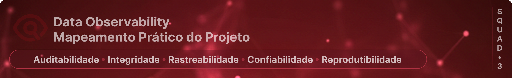

Este documento mapeia como as práticas implementadas no projeto se consolidam nos pilares de **Data Observability**, demonstrando que a observabilidade é uma **propriedade emergente de boas decisões arquiteturais**.

## 🧱 Os 5 Pilares da Observabilidade no Projeto

A observabilidade de dados garante a transparência e a saúde do fluxo de informação, assegurando que o dado disponível para consumo seja confiável e rastreável.

### 1️⃣ Freshness & Integridade Física
**Como é atendido:**
* **Auditoria de Particionamento (Hive):** Validação programática (Audit) que garante que o conteúdo cronológico dos dados condiz com a estrutura de pastas `ano_mes=YYYYMM` no S3.
* **Rastreabilidade:** Cada diretório é encapsulado por um `run_id` (Timestamp ISO), permitindo identificar o "atraso" entre a origem e o Lake.
* **Metadado de Ingestão:** Uso da coluna técnica `ingestion_ts` em todos os registros para auditoria de tempo real de carga.

---

### 2️⃣ Volume & Tamanho
**Como é atendido:**
* **Cross-check de Volumetria:** A auditoria de partições realiza a contagem de registros por safra, garantindo que não houve perda de dados durante a fragmentação física entre camadas.
* **Saúde de Safra (Health Check):** Monitoramento programático da representatividade percentual de cada mês (regra 10%-90%) dentro da Gold Pipeline, evitando o processamento de cargas incompletas.
* **Eficiência Física:** O profiling rastreia o tamanho comprimido (MiB) no S3, monitorando anomalias de armazenamento ou falhas de compressão.

---

### 3️⃣ Schema (Contratos de Dados)
**Como é atendido:**
* **Validação Pandera:** Aplicação de contratos de dados rigorosos na ingestão (Bronze) e na promoção para Silver, garantindo que tipos e regras de negócio sejam respeitados.
* **Prevenção de Efeito Cascata:** O bloqueio de schemas inválidos impede que dados corrompidos cheguem às camadas analíticas de modelagem.

---

### 4️⃣ Distribution (Perfil dos Dados)
**Como é atendido:**
- **Sanidade Estatística:** O profiling automatizado calcula cardinalidade, percentual de nulos e distribuição de valores (Top 10).
- **Audit de Overlap (Riqueza de Informação):** Monitoramento da taxa de encontro de chaves entre camadas (Gold vs Silver). Garante que a distribuição de features é suficiente para o público-alvo selecionado.
- **Detecção de Anomalias:** Facilita a identificação visual de desbalanceamento nas partições `ano_mes`.

---

### 5️⃣ Lineage & Rastreabilidade
**Como é atendido:**
* **Mapeamento de Dependências:** Documentação explícita da jornada do dado entre as camadas do Lake disponível em `docs/data_lineage`.
* **Isolamento de Erros:** A estrutura de `run_id` permite que o Lineage seja "versionado" - sabemos exatamente qual versão do código gerou qual versão do dado.
* **Evidência Persistente:** O vínculo entre código e dado é selado pela persistência do log de execução original junto aos dados no Data Lake, garantindo que o rastro técnico nunca se perca.

## 🛠️ Implementação da Confiabilidade (Reliability)

A confiabilidade é sustentada pelo **Protocolo de Execução Segura**:

1. **Idempotência:** O reprocessamento de um mesmo mês (`ano_mes`) não gera duplicidade, pois a nova `run_id` substitui logicamente a anterior.
2. **Capacidade de Rollback:** A Política de Retenção mantendo `MAX_RUNS > 1` é o nosso mecanismo de "Undo", permitindo reverter o Lake para um estado estável em segundos caso o pilar de Quality falhe.

## 📂 Evidências de Auditoria (Observability Reports)

A observabilidade é materializada através de artefatos gerados em tempo de execução. Para garantir a governança, estes arquivos são mantidos em última versão local e **historicamente no Data Lake** em `s3://lake/observability/reports/run_id={id}/`:

- **Master Pipeline Log:** [`reports/observability/integrity/`](../../bin/reports/pipeline_run_20260129.log) - Registro sequencial técnico (caixa-preta) de todas as etapas do pipeline.
- **Integridade de Partições:** [`reports/observability/integrity/`](../../reports/observability/integrity/) - Validação física e cross-check cronológico.
- **Qualidade de Pipeline (Safra/Overlap):** [`reports/observability/quality/pipeline/`](../../reports/observability/quality/pipeline/) - Auditoria de volumetria e match de chaves.
- **Diagnósticos Estatísticos:** [`reports/observability/profiling/`](../../reports/observability/profiling/) - Saúde estatística e distribuição (Data Discovery).
- **Contratos de Dados (Pandera):** [`reports/observability/quality/pandera/`](../../reports/observability/quality/pandera/) - Validação de schemas e regras.
- **Diagnóstico de Público (EDA):** [`reports/observability/eda/`](../../reports/observability/eda/) - Artefatos analíticos (tabelas e figuras) que fundamentam o estudo do perfil de risco e público-alvo.

## 🧭 Navegação de Observabilidade no Data Lake

Para auditar uma execução específica, a estrutura no S3 deve ser consultada seguindo o padrão:
`s3://lake/observability/reports/run_id=YYYYMMDD/`

1. **Raiz da Pasta:** Contém o arquivo `.log` consolidado da execução do pipeline.
2. **Subpastas:** Contêm os relatórios detalhados em `.md` (Profiling) e logs de integridade/qualidade.

## 🧠 Conclusão: Observabilidade como Resultado

Neste projeto, a observabilidade não é uma ferramenta externa, mas o resultado direto da integração entre **Código, Governança e Arquitetura**:

* O pipeline em execução gera **Logs de Freshness e Volume**.
* O profiling gera **Diagnósticos de Distribuição e Schema**.
* A política de retenção garante a **Resiliência e Reliability**.

A observabilidade emerge como resultado natural da união entre **Código, Governança e Arquitetura**.