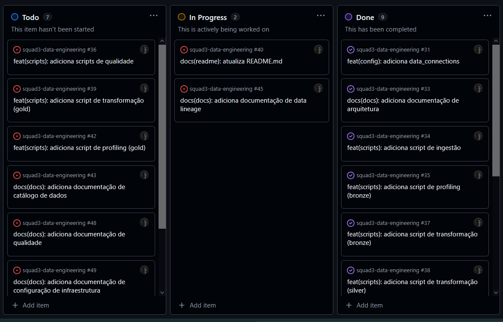

# 📋 Plano de Trabalho: Divisão de Tarefas e Responsabilidades

Este documento detalha a metodologia de gestão do projeto e a distribuição de responsabilidades entre os membros da Squad, visando garantir agilidade, governança e entregas incrementais na Prova de Conceito (PoC).

---

## ⚡ Agilidade e Planejamento

### Metodologia Híbrida
O planejamento do projeto foi estruturado combinando as boas práticas do **PMBOK** (garantindo governança, controle de escopo, riscos e custos) com **Metodologias Ágeis**, priorizando entregas incrementais e adaptação contínua. Esta abordagem permite o controle rigoroso de prazos e recursos em paralelo com a flexibilidade para pivotar estratégias de processamento conforme a análise dos dados.

### Gestão do Fluxo (Kanban)
A gestão das atividades é realizada por meio de quadros Kanban no **GitHub Projects**, integrando planejamento, execução e versionamento em um único ecossistema. Para garantir a especialização técnica e a fluidez das entregas, dividimos a gestão em dois projetos distintos:

* **Data & Analytics - Squad 3:** Focado no ciclo de vida da ciência de dados e modelos de ML.
* **Data Engineering - Squad 3:** Focado na infraestrutura de processamento, orquestração e sustentação do Data Lake.

O uso desses quadros possibilita:
* Controle visual detalhado das tarefas (*To Do, In Progress, Done*).
* Monitoramento preciso de **Milestones do Projeto**, como a finalização de camadas específicas ou deploy de modelos.
* Identificação de dependências críticas entre engenharia e analytics.

---

## 👥 Organização da Squad e Responsabilidades

A equipe é composta por 10 especialistas, organizados para garantir a fluidez do dado desde a origem até o consumo final.

### ⚙️ Engenharia de Dados (3 Membros)
* **Foco:** Construção e manutenção da infraestrutura de dados.
* **Responsabilidades:** Ingestão de dados no **MinIO**, desenvolvimento de pipelines no **DuckDB**, orquestração via **Airflow** e implementação de políticas de retenção e particionamento.

### 🧠 Ciência de Dados (3 Membros)
* **Foco:** Inteligência de dados e modelagem preditiva.
* **Responsabilidades:** Feature Engineering na camada Gold, treinamento de modelos, versionamento de experimentos via **MLflow** e entrega de arquivos de produção (`.pkl`).

### 📈 Análise de Dados (2 Membros)
* **Foco:** Tradução de dados em insights de negócio.
* **Responsabilidades:** Criação de dashboards interativos via **Streamlit**, exploração de dados (EDA) e validação dos modelos lógicos no **PostgreSQL/dbt**.

### 📝 Documentação e Governança (2 Membros)
* **Foco:** Manutenção do conhecimento e conformidade técnica.
* **Responsabilidades:** Mapeamento de Lineage, documentação técnica (Profiling/Data Dictionary) e garantia de que as políticas de governança estão sendo aplicadas via código.